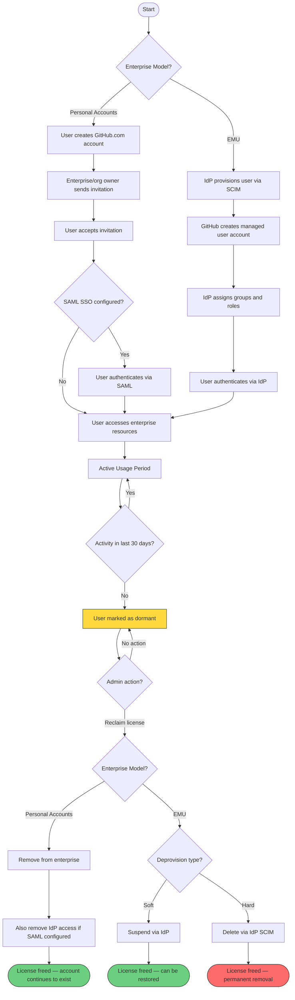
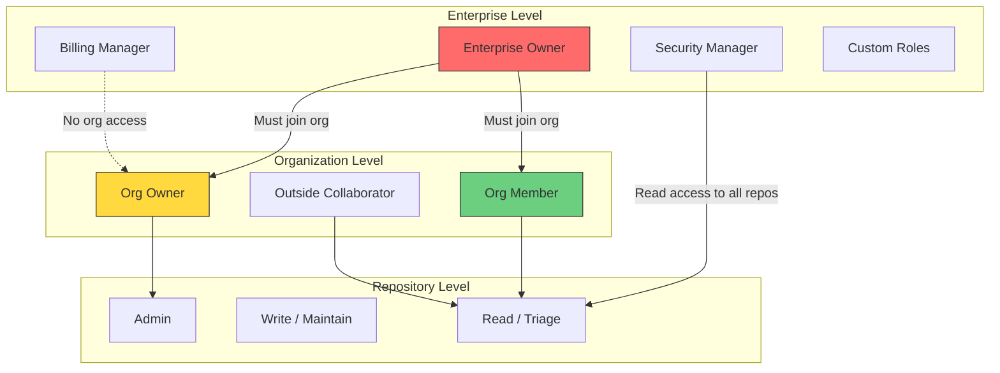
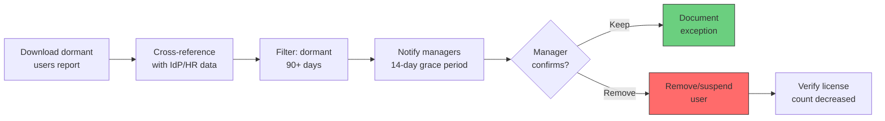

# User Administration and Dormant Users

**Level:** L300 (Advanced)  
**Objective:** Master user lifecycle management, dormant user identification, license reclamation, and credential governance for GitHub Enterprise Cloud deployments

## Overview

GitHub Enterprise Cloud (GHEC) provides a comprehensive user lifecycle management system that spans from initial provisioning through role assignment, activity monitoring, and eventual offboarding. Effective user administration is critical for maintaining security, controlling costs, and ensuring compliance across your enterprise.

There are two fundamentally different enterprise models that dictate how users are managed:

- **Enterprises with personal accounts** — users bring their own GitHub.com accounts and are invited to the enterprise
- **Enterprise Managed Users (EMU)** — the enterprise controls the full user lifecycle from an external identity provider via SCIM

The choice of model affects how users are provisioned, how dormancy is tracked, how credentials are governed, and how offboarding is performed. This document provides L300 administrators with the knowledge and tools to manage users effectively across both models.

Dormant user management is a critical cost-optimization and security function. GitHub considers a user dormant if they have not performed any qualifying activity within the past 30 days. Enterprise owners can download a dormant users report from the Compliance tab and use it to identify candidates for license reclamation. Understanding what counts — and critically, what does not count — as qualifying activity is essential for accurate dormancy assessment.

Credential governance rounds out the user administration story. Enterprise owners can enforce PAT lifetime policies, restrict access by token type, require approval workflows for fine-grained PATs, manage SSH certificate authorities, and audit authorized credentials per user through the SAML identity panel.

## User Lifecycle

### Enterprise Models

GitHub Enterprise Cloud supports two fundamentally different approaches to user identity and lifecycle management. The choice of model is made at enterprise creation time and cannot be changed without migrating to a new enterprise.

| Feature | Personal Accounts | Enterprise Managed Users |
|---------|------------------|--------------------------|
| Account creation | User creates their own GitHub.com account | IdP provisions via SCIM |
| Username control | User chooses | IdP assigns (normalized) |
| Profile changes | User controls | IdP controls; cannot change on GitHub |
| Public repos/contributions | Allowed | **Not allowed** |
| Collaboration outside enterprise | Allowed | **Not allowed** |
| Offboarding | Remove from enterprise | Suspend via IdP (SCIM deprovision) |
| Guest collaborator role | Outside collaborator (not provisioned by IdP) | Guest collaborator (provisioned by IdP) |
| Internal repo access | All org members see all internal repos | Same, except guest collaborators only see internal repos in their orgs |

### Personal Account Lifecycle

In enterprises with personal accounts, the user lifecycle follows this pattern:

1. **Account creation** — The user creates their own GitHub.com account independently
2. **Enterprise invitation** — Enterprise owners or org owners invite the user
3. **SSO authentication** — If SAML SSO is configured, the user links their account
4. **Role assignment** — Admins assign enterprise and organization roles
5. **Active usage** — The user participates in enterprise activities
6. **Dormancy monitoring** — Admins track activity through dormant user reports
7. **Offboarding** — Admins remove the user from the enterprise when appropriate

**Key characteristic:** The user's GitHub.com account continues to exist after removal from the enterprise. Personal repositories, public contributions, and account settings remain intact.

### EMU Account Lifecycle

In Enterprise Managed User enterprises, the identity provider controls the entire lifecycle:

1. **IdP provisioning** — The IdP creates the user account via SCIM
2. **Automatic configuration** — Username, profile data, org membership, and repo access are set by the IdP
3. **SSO authentication** — Users authenticate through the IdP (SAML 2.0 or OIDC)
4. **IdP-driven changes** — Role changes, group memberships, and access updates flow from the IdP
5. **Activity monitoring** — Admins track activity through dormant user reports
6. **Soft-deprovisioning** — IdP suspends the user (reversible)
7. **Hard-deprovisioning** — IdP permanently removes the user (irreversible)

**Key characteristic:** The enterprise owns and controls the user account entirely. Users cannot create public content or collaborate outside the enterprise boundaries.

### User Lifecycle Flow



### Offboarding Considerations

The recommended offboarding approach depends on the enterprise model:

**Personal account enterprises:**
- Remove the user from the enterprise account (UI or `removeEnterpriseMember` GraphQL mutation)
- Also remove from the IdP if SAML SSO is configured to prevent re-entry via the SAML endpoint
- The user stops consuming a license immediately after removal
- Removing a user from all organizations is **not sufficient** if the unaffiliated users policy is enabled — the user remains in the enterprise as unaffiliated

**EMU enterprises:**
- Suspend the user via the IdP, which triggers SCIM deprovisioning
- Cannot fully remove managed users from the enterprise — they show as "suspended"
- Choose soft-deprovisioning for temporary departures and hard-deprovisioning only for permanent separations

**Data preservation for both models:**
- Commits, issues, pull requests, and comments in organization-owned repositories are retained
- PATs, SSH keys, and app authorizations can no longer access enterprise resources
- For EMU hard-deprovisioning specifically, PATs, SSH keys, GPG keys, and user-owned repositories are **deleted**

## Enterprise and Organization Roles

### Enterprise-Level Roles

GitHub Enterprise Cloud defines a hierarchy of enterprise-level roles that control administrative access:

| Role | Description | Org Content Access |
|------|-------------|--------------------|
| **Enterprise owner** | Complete control: manage admins, add/remove orgs, enforce policies, manage billing and security settings | **No** — must explicitly join an organization |
| **Billing manager** | View and manage user licenses, usage-based billing, and billing settings only | No (except internal repos in orgs where they are a member) |
| **App manager** | View, create, edit, and delete GitHub App registrations owned by the enterprise | No |
| **Security manager** | View security results, manage security configurations, access alerts/dashboards across all repos (public preview) | Read access to code in all repos; write access to security alerts |
| **User (member)** | No administrative access by default; includes org members and unaffiliated users | Only in orgs where they are a member |
| **Guest collaborator** | EMU only — provisioned by IdP with limited access; cannot see internal repos except in assigned orgs | Limited to explicitly assigned orgs |

> **⚠️ Critical Detail:** Enterprise owners do **not** automatically have access to organization content. They must join an organization to access its repositories, issues, and other resources. This is one of the most common misconceptions in GitHub Enterprise Cloud administration.

### Custom Enterprise Roles

Enterprise owners can create custom roles to delegate specific administrative responsibilities without granting full enterprise owner access:

**Available custom role permissions:**
- Manage enterprise policies and settings
- Manage organization membership and settings
- Manage billing and licensing
- View and manage security configurations
- Manage GitHub App registrations
- Manage audit log and compliance settings

**Best practices for custom roles:**
- Follow the principle of least privilege
- Create role-specific custom roles (e.g., "Security Admin," "License Manager")
- Document custom role assignments and review quarterly
- Use custom roles to reduce the number of enterprise owners

### Organization-Level Roles

Within each organization, users can hold specific roles that control their access and capabilities:

| Role | Description |
|------|-------------|
| **Organization owner** | Complete administrative access to the organization |
| **Organization member** | Default non-admin role; can create repos and projects |
| **Moderator** | Can block/unblock non-member contributors, set interaction limits, hide comments |
| **Billing manager** | Manages organization billing settings |
| **Security manager** | View security alerts and manage security settings across the org |
| **GitHub App manager** | Manage GitHub App registrations for the organization |
| **Outside collaborator** | Access to specific repositories without organization membership |

### Role Inheritance and Access Boundaries

Understanding how roles interact across enterprise and organization boundaries is essential for proper access governance:



**Key principles:**
- Enterprise roles do **not** cascade into organization content access (except Security Manager)
- Organization roles determine repository-level access within that organization
- Team memberships provide the most granular repository access control
- Outside collaborators receive repository-level access without organization membership

### Role Assignment Best Practices

| Practice | Recommendation |
|----------|---------------|
| Enterprise owners | Limit to 2–4 people; use custom roles for delegation |
| Organization owners | Assign to team leads or platform engineers responsible for the org |
| Security managers | Assign to security team members who need cross-repo visibility |
| Outside collaborators | Use sparingly; prefer team-based access for regular contributors |
| Custom roles | Create purpose-specific roles; review assignments quarterly |

## Invitation and Onboarding

### Personal Account Invitation Flow

For enterprises with personal accounts, the invitation process follows these steps:

1. **Enterprise-level invitations:**
   - Enterprise owners can invite users directly to the enterprise as unaffiliated members
   - Enterprise owners can invite new enterprise owners and billing managers via enterprise settings
   - Navigate to **Enterprise settings → People → Invite admin** or **Invite member**

2. **Organization-level invitations:**
   - Organization owners invite users to specific organizations
   - Users receive an email notification with an invitation link
   - Users must accept the invitation within 7 days (invitations expire)

3. **SAML SSO linking:**
   - If SAML SSO is configured, users must authenticate through the IdP after accepting
   - The SAML identity is linked to their GitHub.com account
   - Subsequent access requires SSO authentication

4. **Post-onboarding:**
   - Assign to appropriate teams for repository access
   - Verify 2FA enrollment if required by enterprise policy
   - Confirm organization membership in the People tab

### EMU SCIM Provisioning Flow

For EMU enterprises, user onboarding is driven entirely by the identity provider:

1. **IdP configuration:**
   - Configure the GitHub EMU application in your IdP (Entra ID, Okta, or PingFederate)
   - Set up SCIM provisioning with a PAT (classic) scoped to `scim:enterprise`
   - Map user attributes (username, email, display name)

2. **User provisioning:**
   - Assign users to the GitHub EMU application in the IdP
   - The IdP sends a `POST /scim/v2/enterprises/{enterprise}/Users` request
   - GitHub creates the managed user account with IdP-controlled attributes

3. **Group provisioning:**
   - Assign users to IdP groups mapped to GitHub organizations and teams
   - Provision users **before** provisioning groups (GitHub recommendation)
   - Do not exceed 1,000 users per hour or 1,000 users per group per hour

4. **Access activation:**
   - Users authenticate through the IdP to access GitHub
   - Organization membership and repository access are determined by IdP group assignments

```bash
# Example: Query provisioned users via SCIM API
curl -s -H "Authorization: Bearer $SCIM_TOKEN" \
  -H "Accept: application/scim+json" \
  "https://api.github.com/scim/v2/enterprises/YOUR-ENTERPRISE/Users?count=10" \
  | jq '.Resources[] | {userName, active, id}'
```

### Pending Invitations

Enterprise owners should regularly monitor pending invitations to maintain accurate license counts:

**Viewing pending invitations:**
- Navigate to **Enterprise settings → People → Invitations**
- Pending invitations are categorized: members, admins, outside collaborators
- Each pending invitation to an outside collaborator consumes a license

**Managing stale invitations:**
- Review and cancel invitations that have been pending for more than 7 days
- For SCIM-provisioned invitations, cancel via the IdP — not the GitHub UI
- Use the REST API to list and manage invitations programmatically

**Pending invitation impact:**
| Invitation Type | Consumes License | Auto-Expires |
|----------------|-----------------|--------------|
| Organization member | No (until accepted) | Yes (7 days) |
| Outside collaborator (private/internal repo) | **Yes** | Yes (7 days) |
| Enterprise admin | No | Yes (7 days) |

### Membership Export

Enterprise owners can export comprehensive membership data for reporting and compliance:

**CSV export process:**
1. Navigate to **Enterprise settings → People**
2. Click **Export** to download membership information
3. For enterprises with < 1,000 members, the CSV downloads immediately
4. For enterprises with ≥ 1,000 members, an email with a download link is sent

**CSV fields include:**
- Username and display name
- Two-factor authentication (2FA) status
- Organization owner/member status
- Pending organization invitations
- Verified domain email addresses
- SAML NameID
- GitHub Enterprise Server usernames (if GitHub Connect is configured)

**API access for programmatic reporting:**

```graphql
# Query enterprise members via GraphQL
query {
  enterprise(slug: "YOUR-ENTERPRISE") {
    members(first: 100) {
      totalCount
      nodes {
        ... on EnterpriseUserAccount {
          login
          name
          createdAt
          organizations(first: 10) {
            nodes {
              login
            }
          }
        }
      }
      pageInfo {
        hasNextPage
        endCursor
      }
    }
  }
}
```

### Onboarding Checklist

Use this checklist to ensure consistent user onboarding across your enterprise:

| Step | Personal Accounts | EMU |
|------|------------------|-----|
| Provision account | Invite via UI/API | Configure in IdP |
| Assign to organization | Org owner invites | IdP group assignment |
| Assign to teams | Team maintainer adds | IdP group mapping |
| Configure SSO | User links SAML identity | Automatic via IdP |
| Verify 2FA | Check compliance dashboard | Handled by IdP |
| Grant repo access | Via team membership | Via IdP group mapping |
| Assign Copilot license | Enterprise/org settings | Enterprise/org settings |
| Communicate onboarding guide | Email/wiki | Email/wiki |

## Outside Collaborator Management

### Definition and License Impact

Outside collaborators are users who have access to one or more organization repositories but are not organization members. They serve a critical role for vendor, contractor, and partner access patterns.

**Key characteristics:**
- Access is granted at the repository level, not the organization level
- Cannot be added to teams (team membership requires organization membership)
- Each outside collaborator with access to private or internal repos **consumes a license**
- Pending invitations to outside collaborators also consume licenses
- Not required to use SAML SSO to access organization resources (personal account enterprises)
- Must enable 2FA before accepting invitations if the organization requires it

### Repository Collaborators in EMU

In EMU enterprises, the equivalent of an outside collaborator is called a **repository collaborator**:

- Must be part of the enterprise with a managed user account provisioned from the IdP
- If they don't already consume a license, they will after being granted repository access
- Cannot bypass SSO (managed at enterprise level)
- Subject to enterprise IP allow list and IdP Conditional Access Policy
- **Not** subject to organization-level IP allow list

### Enterprise Policies for Outside Collaborators

Enterprise owners can configure policies that govern outside collaborator behavior across all organizations:

| Policy | Options | Recommendation |
|--------|---------|----------------|
| Who can invite outside collaborators | Org owners only / Org members / Enterprise setting | Restrict to org owners for better governance |
| Repository visibility for outside collaborators | Private + internal / Private only | Private only unless innersource collaboration is needed |
| Base permissions for outside collaborators | No access / Read / Write | No access (grant explicitly per repo) |

**Configuring the policy:**
1. Navigate to **Enterprise settings → Policies → Repository management**
2. Under "Outside collaborators," select the desired restriction level
3. Choose whether organizations can override the enterprise setting

### Audit and Tracking

Monitoring outside collaborator access is essential for security and compliance:

**Viewing outside collaborators:**
- **Enterprise level:** Enterprise settings → People → Outside collaborators
- **Organization level:** Organization settings → People → Outside collaborators
- **Repository level:** Repository settings → Collaborators

**Audit log events for outside collaborators:**

| Event | Description |
|-------|-------------|
| `repo.add_member` | Outside collaborator added to a repository |
| `repo.remove_member` | Outside collaborator removed from a repository |
| `org.invite_member` | Invitation sent to a potential outside collaborator |
| `org.cancel_invitation` | Pending invitation cancelled |

**Important limitation:** Outside collaborators cannot be removed via enterprise settings. They must be removed from each repository or organization individually by an organization owner.

**Regular review process:**
1. Export the outside collaborator list from the enterprise People tab
2. Cross-reference with your vendor/contractor management system
3. Remove access for collaborators whose engagements have ended
4. Verify remaining collaborators have appropriate repository access levels
5. Document review findings and actions taken

## Dormant User Identification

### Definition of Dormancy

A user account is considered **dormant** if it has not been active for **30 days**. Only enterprise owners can access dormant user reports. The 30-day window is fixed and cannot be configured by administrators.

> **⚠️ Important:** You cannot manually mark a dormant user as active. The user must perform one of the qualifying activities listed below to reset their dormancy timer.

### Activities That Count as Active

The following activities on enterprise-associated resources mark a user as active:

| Category | Qualifying Activities |
|----------|----------------------|
| **Authentication** | Authenticating via SAML SSO |
| **Repository management** | Creating a repository, changing repository visibility, deleting a repository |
| **Git operations** | Pushing to an internal repository via HTTPS |
| **Issues** | Creating, closing, or reopening an issue; applying/removing labels; assigning/unassigning |
| **Pull requests** | Creating, closing, or reopening a PR; synchronizing a PR; requesting/removing review requests |
| **Code review** | Creating/editing PR review comments; dismissing a PR comment |
| **Collaboration** | Commenting on an issue, PR, or commit; publishing a release; pushing to a wiki |
| **Social** | Starring a repository |
| **Organization** | Joining an organization; being added to a repository |

### Activities That Do NOT Count as Active

Understanding what does **not** count as activity is critical for accurate dormancy assessment:

> **🚨 Major Gotcha for Administrators:** The following common developer activities do **NOT** count toward the 30-day activity window and will **not** prevent a user from being marked as dormant.

| Non-Qualifying Activity | Why It Matters |
|------------------------|----------------|
| **Accessing resources via PAT** | CI/CD pipelines using PATs do not generate qualifying activity |
| **Accessing resources via SSH key** | Developers using SSH for Git operations may appear dormant |
| **Accessing resources via GitHub App** | Automated workflows using GitHub Apps do not generate activity |
| **Git operations on private repositories** | Push, pull, clone on private repos via Git do NOT count |
| **Activity on public repos outside the enterprise** | Open source contributions do not count toward enterprise activity |
| **Reading/browsing without interaction** | Viewing repositories, reading issues, or reviewing code without taking action |

**Practical impact:** A developer who exclusively uses PATs or SSH keys for CI/CD and Git operations on private repositories may appear dormant even though they are actively using GitHub every day. This is the #1 misconception that leads to incorrectly reclaiming licenses from active developers.

### Downloading the Dormant Users Report

The dormant users report provides a CSV file listing all users who have not performed qualifying activity in the past 30 days:

**Steps to download:**
1. Navigate to the enterprise account
2. Click **Compliance** at the top of the page
3. Scroll to the "Reports" section
4. Optionally click **New report** next to "Dormant Users" to generate a fresh report
5. Under "Recent reports," click **Download** next to the desired report

**Report contents:**
- Username and display name
- Email address
- Last active date
- Organization memberships
- Enterprise role

### Dormant Users in the People View

Enterprise owners can also view dormant users directly in the **People** tab of the enterprise settings without downloading a report:

1. Navigate to **Enterprise settings → People**
2. Use the filter dropdown to select **Dormant**
3. The list shows all users who have not been active in the past 30 days
4. Click on individual users to see their organization memberships and roles

**Combining data sources for accurate assessment:**
- Cross-reference the dormant users report with audit log data
- Check if "dormant" users have PAT or SSH key activity in the audit log
- Consult with team leads before reclaiming licenses from users who may be active via non-qualifying methods
- Consider seasonal patterns (e.g., users on leave may appear dormant temporarily)

## License Reclamation

### How Licensing Works

GitHub Enterprise uses a **unique-user licensing model** where each user consumes exactly one license regardless of how many organizations they belong to:

| Scenario | Consumes License? |
|----------|-------------------|
| User is a member of 1 organization | Yes (1 license) |
| User is a member of 5 organizations | Yes (1 license) |
| Outside collaborator with private/internal repo access | Yes (1 license) |
| Pending invitation to outside collaborator | Yes (1 license) |
| Unaffiliated user (no org membership, no admin role) | **No** |
| Suspended EMU user | **No** |
| Bot accounts (GitHub Apps) | **No** |

### Reclamation for Personal Account Enterprises

For enterprises with personal accounts, follow this license reclamation workflow:

**Step 1: Identify dormant users**
1. Download the dormant users report from the Compliance tab
2. Filter for users dormant for more than 60–90 days (allows buffer for vacations)
3. Cross-reference with HR/team data to identify genuinely inactive users

**Step 2: Validate before removing**
- Check if the user has PAT/SSH-based activity in the audit log
- Confirm with the user's manager or team lead
- Verify the user is not a service account or shared account

**Step 3: Remove dormant members**
- Via UI: Enterprise settings → People → Select user → Remove from enterprise
- Via API: Use the `removeEnterpriseMember` GraphQL mutation

```graphql
# Remove a dormant user from the enterprise
mutation {
  removeEnterpriseMember(input: {
    enterpriseId: "ENTERPRISE_NODE_ID"
    userId: "USER_NODE_ID"
  }) {
    user {
      login
    }
  }
}
```

**Step 4: Clean up IdP access**
- If SAML SSO is configured, also remove the user from the IdP application
- Failure to remove IdP access allows the user to rejoin via the SAML endpoint

**Important:** Removing a member removes them from **all organizations** owned by the enterprise. If the enterprise member is the last owner of an organization, the enterprise owner inherits ownership.

### Reclamation for EMU Enterprises

For EMU enterprises, license reclamation is driven through the identity provider:

1. Download the dormant users report and cross-reference with IdP group assignments
2. **Soft-deprovision** via the IdP to suspend the user (reversible)
3. Suspended users immediately stop consuming licenses
4. Only use **hard-deprovisioning** when certain the user will not return (irreversible)

```bash
# Soft-deprovision: Suspend a user via SCIM PATCH
curl -X PATCH \
  -H "Authorization: Bearer $SCIM_TOKEN" \
  -H "Content-Type: application/scim+json" \
  "https://api.github.com/scim/v2/enterprises/YOUR-ENTERPRISE/Users/$SCIM_USER_ID" \
  -d '{"Operations": [{"op": "replace", "value": {"active": false}}]}'
```

### Automation Approaches

Automating dormant user management reduces administrative overhead and ensures consistent enforcement:

| Approach | Description | Complexity |
|----------|-------------|------------|
| **Scheduled report review** | Monthly download and manual review of dormant users report | Low |
| **GraphQL API automation** | Script that queries enterprise members and cross-references with dormant report | Medium |
| **IdP-driven automation** | IdP workflows that suspend users based on HR system signals | Medium |
| **Full pipeline** | Automated dormant detection → manager notification → grace period → removal | High |

**Example automation pipeline:**



### Cost Impact Analysis

Understanding the financial impact of dormant user management helps justify the administrative effort:

**License cost calculation:**
- Each dormant user consumes one GitHub Enterprise Cloud seat
- Annual cost per unused seat = your per-seat licensing cost
- Potential savings = (number of dormant users × per-seat cost)

**Example impact assessment:**

| Metric | Value |
|--------|-------|
| Total enterprise users | 5,000 |
| Dormant users (30+ days) | 750 (15%) |
| Dormant users (90+ days) | 400 (8%) |
| Annual per-seat cost | ~$21/month ($252/year) |
| Potential annual savings (90+ day dormant) | ~$100,800 |

**Ongoing monitoring recommendations:**
- Track dormant user percentage monthly as a KPI
- Set organizational targets (e.g., < 5% dormant rate)
- Include dormant user metrics in quarterly business reviews
- Automate alerts when dormant rate exceeds thresholds

## Credential Governance

### Personal Access Token Policies

Enterprise owners can enforce PAT policies independently for fine-grained and classic tokens. These policies control how tokens can be used to access enterprise resources.

**Access restriction options:**

| Setting | Behavior |
|---------|----------|
| **Allow organizations to configure** (default) | Each organization decides its own PAT policy |
| **Restrict access** | PATs cannot access enterprise organizations; SSH keys still work; organizations cannot override |
| **Allow access** | PATs can access enterprise organizations; organizations cannot override |

### PAT Lifetime Policies

Enterprise owners can enforce maximum lifetimes for both token types:

| Policy | Fine-Grained Tokens | Classic Tokens |
|--------|---------------------|----------------|
| Default maximum lifetime | 366 days | No default limit |
| Configurable maximum | Yes (enterprise setting) | Yes (enterprise setting) |
| Non-compliant token behavior | Blocked at usage time (not revoked) | Blocked at usage time (not revoked) |
| Administrator exemption | Available | Available |
| EMU behavior | Applies to user namespaces as well | Applies to user namespaces as well |

**Configuration steps:**
1. Navigate to **Enterprise settings → Policies → Personal access tokens**
2. Under "Maximum lifetime," set the desired limit for each token type
3. Enable **Exempt administrators** if using SCIM or automation that requires long-lived tokens
4. Save changes — existing non-compliant tokens are blocked at next use, not revoked

> **⚠️ EMU + SCIM Warning:** The SCIM provisioning token must be a PAT (classic) with `scim:enterprise` scope. If you enforce PAT lifetime restrictions, you **must** exempt administrators to avoid breaking SCIM provisioning. GitHub recommends no expiration date on the SCIM token.

### Fine-Grained PAT Approval

Fine-grained personal access tokens support an approval workflow that gives organization owners visibility into token requests:

| Setting | Behavior |
|---------|----------|
| **Allow organizations to configure** (default) | Each org sets its own approval policy |
| **Require approval** | All organizations must approve each fine-grained PAT before it can access resources |
| **Disable approval** | Fine-grained PATs work without prior approval in all organizations |

**Approval workflow:**
1. Developer creates a fine-grained PAT requesting access to specific repositories
2. Organization owner receives a notification to review the request
3. Organization owner approves or denies the token request
4. If approved, the token can access the requested repositories with the specified permissions

### SSH Key and Certificate Management

Enterprise owners can manage SSH access through certificate authorities and key policies:

**SSH Certificate Authorities (CAs):**
- Enterprise owners add SSH CAs under **Settings → Authentication security**
- When an SSH CA is added, members can use SSH certificates issued by the CA to access organization repos
- Enterprise owners can **require SSH certificates** — users cannot authenticate with unsigned SSH keys or HTTPS
- For EMU enterprises, SSH CAs can be configured to allow access to user-owned (namespace) repositories
- CAs uploaded before March 27, 2024 allow non-expiring certificates; newer CAs require expiration
- Enterprise owners can **upgrade** older CAs to reject non-expiring certificates

**SSH CA configuration:**

```bash
# Upload an SSH CA public key via the API
gh api \
  --method POST \
  /enterprises/YOUR-ENTERPRISE/audit-log/ssh-certificates \
  -f key="$(cat ca_key.pub)"

# List existing SSH CAs
gh api /enterprises/YOUR-ENTERPRISE/audit-log/ssh-certificates
```

### SAML Credential Audit

Enterprise owners can view and manage authorized credentials for each user through the SAML identity panel:

**Viewing authorized credentials:**
1. Navigate to **Enterprise settings → People**
2. Click on a specific user
3. Select **SAML identity linked**
4. View authorized PATs and SSH keys (only last several characters visible)

**Credential revocation:**
- Individual credentials can be revoked from the SAML identity panel
- Revocation removes the SAML authorization — it does **not** delete the underlying token or key
- The user must re-authenticate via SAML SSO to use the credential again
- For EMU hard-deprovisioning, PATs, SSH keys, and GPG keys are **deleted** (not just revoked)

### 2FA Enforcement

Enterprise owners can require two-factor authentication (2FA) for all users:

| Setting | Description |
|---------|-------------|
| Require 2FA for all members | All organization members must enable 2FA |
| Require 2FA for outside collaborators | Outside collaborators must enable 2FA before accepting invitations |
| Require secure methods only | Restrict to passkeys, security keys, authenticator apps, and GitHub Mobile |
| Non-compliant user behavior | Users without 2FA are **removed from the organization** and lose access to repo forks |
| Reinstatement window | Users can reinstate access within 3 months if they enable 2FA |
| EMU applicability | **Not available** — authentication is handled entirely by the IdP |

**Best practices for 2FA enforcement:**
- Enable 2FA requirements before onboarding new users
- Communicate the requirement and provide setup instructions
- Use the secure methods option to prevent SMS-based 2FA (vulnerable to SIM-swapping)
- Monitor 2FA compliance through the enterprise security dashboard

## EMU User Management

### SCIM Provisioning Lifecycle

Enterprise Managed Users (EMU) enables full lifecycle management from an external Identity Provider:

- **IdP provisions new user accounts** on GitHub with access to the enterprise
- **Users authenticate via the IdP** (SAML 2.0 or OIDC) to access enterprise resources
- **Usernames, profile data, org membership, and repo access** are controlled from the IdP
- Managed users **cannot create public content** or collaborate outside the enterprise

**SCIM (System for Cross-domain Identity Management) 2.0** is the protocol used for user lifecycle management. The IdP acts as the single source of truth for all user data.

### Partner IdPs

GitHub provides "paved-path" applications for these partner identity providers:

| IdP | Authentication | SCIM Support |
|-----|---------------|--------------|
| **Microsoft Entra ID** | SAML or OIDC | Yes |
| **Okta** | SAML | Yes |
| **PingFederate** | SAML | Yes |

> **⚠️ Unsupported combination:** Using Okta and Entra ID together (e.g., Okta for SSO and Entra ID for SCIM, or vice versa) is explicitly **not supported**. The SCIM API will return an error.

**OIDC note:** OIDC authentication is only supported with Microsoft Entra ID. All other IdPs must use SAML 2.0.

### SCIM API Endpoints

The SCIM API provides full programmatic control over user provisioning:

| Action | Method | Endpoint |
|--------|--------|----------|
| List provisioned users | `GET` | `/scim/v2/enterprises/{enterprise}/Users` |
| Create a user | `POST` | `/scim/v2/enterprises/{enterprise}/Users` |
| Get a specific user | `GET` | `/scim/v2/enterprises/{enterprise}/Users/{scim_user_id}` |
| Update all user attributes | `PUT` | `/scim/v2/enterprises/{enterprise}/Users/{scim_user_id}` |
| Update individual attribute | `PATCH` | `/scim/v2/enterprises/{enterprise}/Users/{scim_user_id}` |
| Hard-deprovision (permanent) | `DELETE` | `/scim/v2/enterprises/{enterprise}/Users/{scim_user_id}` |

**SCIM token requirements:**
- Must be a PAT (classic) with `scim:enterprise` scope
- Must be associated with the enterprise's setup user
- GitHub recommends no expiration date on this token
- Use `scim:enterprise` scope (not `admin:enterprise`) for least privilege

**Rate limits:**
- Do not assign more than 1,000 users per hour to the SCIM integration
- Do not add more than 1,000 users to each group per hour

### Soft vs Hard Deprovisioning

The choice between soft and hard deprovisioning has significant implications for data retention and recoverability:

**Soft-deprovisioning (reversible):**

| Aspect | Behavior |
|--------|----------|
| **Trigger** | `PUT`/`PATCH` setting `active: false`, disable in Entra ID, unassign from Okta app |
| **User status** | Suspended — loses access |
| **Username** | Obfuscated to hash + shortcode |
| **Email** | Obfuscated (except with Entra ID, where it remains) |
| **SCIM identity** | Remains linked (allows reprovisioning) |
| **Private/internal repo forks** | Deleted within 24 hours; restored if unsuspended within 90 days |
| **IdP groups/mapped teams** | Removed |
| **Contributed resources** | Retained (comments, issues, PRs) |
| **License consumption** | Stops immediately |

**Hard-deprovisioning (irreversible):**

| Aspect | Behavior |
|--------|----------|
| **Trigger** | `DELETE` to SCIM endpoint, hard-deletion in Entra ID |
| **User status** | Permanently suspended — cannot be unsuspended |
| **Username, email, display name** | All obfuscated/cleared |
| **SCIM identity** | Deleted (no link for reprovisioning) |
| **PATs, SSH keys, GPG keys** | **Deleted** (not just revoked) |
| **App authorizations** | Deleted |
| **User-owned repositories** | **Deleted** |
| **Contributed resources** | Retained (comments, issues, PRs) |
| **Recovery** | A new account must be provisioned from scratch |

**Audit log events for deprovisioning:**

| Event | Soft | Hard |
|-------|------|------|
| `user.suspend` | ✓ | |
| `user.remove_email` | ✓ | ✓ |
| `user.rename` | ✓ | |
| `external_identity.deprovision` | ✓ | ✓ |
| `team.remove_member` | ✓ (if in mapped team) | ✓ (if in mapped team) |
| `org.remove_member` | ✓ (if managed by IdP) | ✓ (if managed by IdP) |

### Username Format and Obfuscation

EMU usernames follow specific formatting rules controlled by the IdP:

**Provisioning format:**
- Usernames are normalized from the IdP attribute (typically `userPrincipalName` or `userName`)
- Special characters are replaced; the enterprise shortcode is appended (e.g., `jdoe_contoso`)
- Users cannot change their username on GitHub — changes must be made in the IdP

**Deprovisioning obfuscation:**
- Soft-deprovisioned: Username is replaced with a hash + shortcode (e.g., `ab12cd34_contoso`)
- Hard-deprovisioned: Username, email, and display name are all cleared or obfuscated
- Git history retains the original username in commits, but the profile link becomes inactive

**Impact on Git history:**
- Existing commits retain the original author information
- After deprovisioning, the username in commit history no longer links to an active profile
- Commit signature verification may be affected if GPG keys are deleted (hard-deprovision)

### Guest Collaborators

The guest collaborator role (EMU only) provides limited access for vendors and contractors:

**Characteristics:**
- Provisioned by the IdP with the `guest_collaborator` role attribute
- Can be added as organization members or repository collaborators
- **Cannot** access internal repositories except in organizations where they are explicit members
- Key difference: regular EMU users added to one org can access **all** internal repos enterprise-wide; guest collaborators cannot

**Enabling guest collaborators:**

| IdP | Configuration Step |
|-----|-------------------|
| **Entra ID** | Update the application manifest with a `guest_collaborator` role definition |
| **Okta** | Update the profile editor with a `guest_collaborator` role attribute |

**Use cases:**
- Vendor developers who need access to specific project repositories
- Contractors working on time-limited engagements
- Partner organizations collaborating on shared projects
- Consultants who need read access for auditing or advisory work

### EMU Best Practices

Follow these best practices for effective EMU user management:

| Practice | Recommendation |
|----------|---------------|
| **Single source of truth** | Ensure the IdP is the only source of write operations — never make ad hoc SCIM API calls if using a partner IdP |
| **Provisioning order** | Provision users before provisioning groups |
| **Audit log streaming** | Configure streaming to retain data beyond the default 180-day retention |
| **Token scope** | Use `scim:enterprise` scope (not `admin:enterprise`) for least privilege |
| **Rate limiting** | Stay under 1,000 users/hour and 1,000 users/group/hour |
| **Soft-deprovision first** | Default to soft-deprovisioning; only hard-deprovision when certain the user will not return |
| **Regular review** | Cross-reference dormant user reports with IdP group assignments monthly |
| **Guest collaborators** | Use the guest collaborator role for external participants instead of granting full member access |

## References

### Official GitHub Documentation

1. [Managing Users in Your Enterprise](https://docs.github.com/en/enterprise-cloud@latest/admin/managing-accounts-and-repositories/managing-users-in-your-enterprise) — Overview of user management capabilities
2. [About Enterprise Managed Users](https://docs.github.com/en/enterprise-cloud@latest/admin/identity-and-access-management/understanding-iam-for-enterprises/about-enterprise-managed-users) — EMU architecture and capabilities
3. [Managing Dormant Users](https://docs.github.com/en/enterprise-cloud@latest/admin/managing-accounts-and-repositories/managing-users-in-your-enterprise/managing-dormant-users) — Dormancy definition, qualifying activities, and report generation
4. [Deprovisioning and Reinstating Users with SCIM](https://docs.github.com/en/enterprise-cloud@latest/admin/managing-iam/provisioning-user-accounts-with-scim/deprovisioning-and-reinstating-users) — Soft vs hard deprovisioning details
5. [Enforcing Policies for Personal Access Tokens](https://docs.github.com/en/enterprise-cloud@latest/admin/enforcing-policies/enforcing-policies-for-your-enterprise/enforcing-policies-for-personal-access-tokens-in-your-enterprise) — PAT lifetime, access restriction, and approval policies
6. [Enforcing Policies for Security Settings](https://docs.github.com/en/enterprise-cloud@latest/admin/enforcing-policies/enforcing-policies-for-your-enterprise/enforcing-policies-for-security-settings-in-your-enterprise) — SSH CAs, 2FA enforcement, and SAML credential management
7. [Roles in an Enterprise](https://docs.github.com/en/enterprise-cloud@latest/admin/managing-accounts-and-repositories/managing-users-in-your-enterprise/roles-in-an-enterprise) — Enterprise-level role definitions and permissions
8. [Roles in an Organization](https://docs.github.com/en/enterprise-cloud@latest/organizations/managing-peoples-access-to-your-organization-with-roles/roles-in-an-organization) — Organization-level role definitions
9. [Viewing People in Your Enterprise](https://docs.github.com/en/enterprise-cloud@latest/admin/managing-accounts-and-repositories/managing-users-in-your-enterprise/viewing-people-in-your-enterprise) — People tab, filtering, and dormant user views
10. [Exporting Membership Information](https://docs.github.com/en/enterprise-cloud@latest/admin/managing-accounts-and-repositories/managing-users-in-your-enterprise/exporting-membership-information-for-your-enterprise) — CSV export and API access for membership data
11. [GraphQL removeEnterpriseMember Mutation](https://docs.github.com/en/enterprise-cloud@latest/graphql/reference/mutations#removeenterprisemember) — API reference for removing enterprise members
12. [Provisioning Users with SCIM Using the REST API](https://docs.github.com/en/enterprise-cloud@latest/admin/identity-and-access-management/provisioning-user-accounts-for-enterprise-managed-users/provisioning-users-with-scim-using-the-rest-api) — SCIM endpoints, rate limits, and best practices
13. [Enabling Guest Collaborators](https://docs.github.com/en/enterprise-cloud@latest/admin/managing-accounts-and-repositories/managing-users-in-your-enterprise/enabling-guest-collaborators) — Guest collaborator role configuration for EMU
14. [About Licenses for GitHub Enterprise](https://docs.github.com/en/enterprise-cloud@latest/billing/managing-your-license-for-github-enterprise/about-licenses-for-github-enterprise) — Unique-user licensing model
15. [Removing a Member from Your Enterprise](https://docs.github.com/en/enterprise-cloud@latest/admin/managing-accounts-and-repositories/managing-users-in-your-enterprise/removing-a-member-from-your-enterprise) — Member removal process and data preservation
16. [User Offboarding](https://docs.github.com/en/enterprise-cloud@latest/admin/concepts/identity-and-access-management/user-offboarding) — Offboarding procedures for both enterprise models
17. [Adding Outside Collaborators to Repositories](https://docs.github.com/en/enterprise-cloud@latest/organizations/managing-user-access-to-your-organizations-repositories/managing-outside-collaborators/adding-outside-collaborators-to-repositories-in-your-organization) — Outside collaborator management
18. [Viewing and Managing SAML Access](https://docs.github.com/en/enterprise-cloud@latest/admin/managing-accounts-and-repositories/managing-users-in-your-enterprise/viewing-and-managing-a-users-saml-access-to-your-enterprise) — SAML identity panel and credential audit

### Related Workshop Documents

- [03-identity-access-management.md](./03-identity-access-management.md) — Identity and access management fundamentals
- [04-enterprise-managed-users.md](./04-enterprise-managed-users.md) — Deep dive into EMU architecture and configuration
- [05-teams-permissions.md](./05-teams-permissions.md) — Team-based access control and permission hierarchy
- [06-policy-inheritance.md](./06-policy-inheritance.md) — Enterprise and organization policy inheritance
