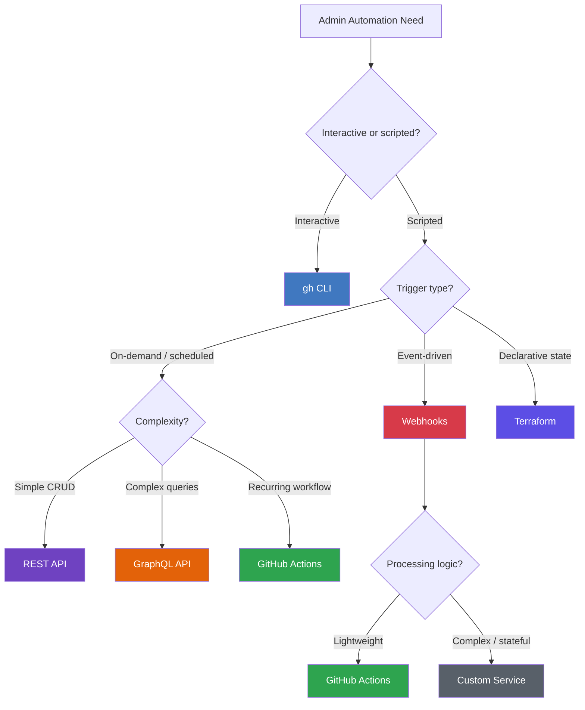

# Scripts and Automation

**Level:** L300 (Advanced)  
**Objective:** Master GitHub's automation ecosystem — CLI scripting, REST and GraphQL APIs, webhooks, Actions workflows, Terraform, and policy-as-code — for enterprise-scale administration

## Overview

GitHub Enterprise Cloud administration at scale demands automation. Manual operations across hundreds of repositories, thousands of users, and complex compliance requirements are unsustainable. GitHub provides a layered automation ecosystem: the **gh CLI** for interactive and scriptable operations, **REST and GraphQL APIs** for programmatic access, **webhooks** for event-driven automation, **GitHub Actions** for scheduled and triggered workflows, and **Terraform** for declarative infrastructure-as-code management.

For GHEC administrators, the critical automation use cases include:

- **Bulk repository management** — creation, archival, settings enforcement
- **User lifecycle management** — onboarding, offboarding, role changes
- **Compliance reporting** — audit log queries, license usage, security posture
- **Policy enforcement** — branch protection, rulesets, code security configurations

The choice of automation tool depends on the use case:

| Use Case | Recommended Tool | Why |
|----------|-----------------|-----|
| Ad-hoc admin tasks | gh CLI | Interactive, fast, scriptable |
| CRUD operations & bulk changes | REST API | Standard HTTP verbs, well-documented |
| Complex reporting queries | GraphQL API | Fetch nested data in one request |
| Real-time event reactions | Webhooks | Push-based, immediate notification |
| Scheduled administrative workflows | GitHub Actions | Cron-based, built-in CI/CD integration |
| Declarative resource management | Terraform | State tracking, drift detection, plan/apply |



## GitHub CLI for Administration

The GitHub CLI (`gh`) is preinstalled on all GitHub-hosted runners and is the fastest path from zero to automation. It wraps both the REST and GraphQL APIs with a developer-friendly interface and supports direct authentication with GHEC.

### Authentication for Enterprise

```bash
# Interactive login to GHEC instance
gh auth login --hostname github.example.com

# Token-based authentication for scripts
export GH_ENTERPRISE_TOKEN="ghp_xxxxxxxxxxxx"
export GH_HOST="github.example.com"

# Verify authentication status
gh auth status
```

Environment variables for scripting:

| Variable | Purpose |
|----------|---------|
| `GH_TOKEN` | Authentication token for github.com |
| `GH_ENTERPRISE_TOKEN` | Authentication token for GHEC/GHES |
| `GH_HOST` | Default hostname (avoids `--hostname` flag) |
| `NO_COLOR` | Disable colored output for log parsing |

### Key Admin Commands

#### Repository Management

```bash
# List all repos in an organization (JSON output for scripting)
gh repo list my-org --limit 1000 --json name,visibility,isArchived

# Create a repo from a template
gh repo create my-org/new-service --private --template my-org/template-repo

# Archive a single repo
gh repo archive my-org/legacy-app --yes

# Clone all org repos for auditing
gh repo list my-org --limit 500 --json nameWithOwner -q '.[].nameWithOwner' | \
  xargs -I {} gh repo clone {}
```

#### Bulk Operations

```bash
# Archive all repos not pushed to in 90+ days
STALE=$(date -d '90 days ago' +%Y-%m-%dT%H:%M:%SZ)
gh repo list my-org --json name,pushedAt --limit 1000 \
  -q ".[] | select(.pushedAt < \"$STALE\") | .name" | \
  while read -r repo; do
    echo "Archiving: $repo"
    gh repo archive "my-org/$repo" --yes
  done

# Bulk-update repo settings via gh api
gh repo list my-org --json name --limit 500 -q '.[].name' | \
  while read -r repo; do
    gh api "repos/my-org/$repo" -X PATCH \
      -F has_wiki=false \
      -F delete_branch_on_merge=true \
      -F allow_auto_merge=true
  done
```

### Using `gh api` for Admin Endpoints

The `gh api` subcommand provides direct access to any GitHub API endpoint with automatic authentication and pagination:

```bash
# Get organization settings (requires admin:org scope)
gh api orgs/my-org --jq '{
  default_permission: .default_repository_permission,
  two_factor: .two_factor_requirement_enabled,
  members_can_create_repos: .members_can_create_repositories,
  members_can_fork_private: .members_can_fork_private_repositories
}'

# List org members with roles
gh api orgs/my-org/members --paginate \
  --jq '.[] | [.login, .site_admin] | @tsv'

# Query the enterprise audit log
gh api /enterprises/my-enterprise/audit-log \
  -F phrase='action:repo.create' \
  -F per_page=100 \
  --paginate

# List repo collaborators with permissions
gh api repos/my-org/my-repo/collaborators --paginate \
  --jq '.[] | [.login, .role_name] | @tsv'
```

### gh CLI Extensions

Extensions are custom commands distributed as repositories. They extend the CLI for specialized admin tasks:

```bash
# Install community extensions
gh extension install mislav/gh-branch-clean
gh extension install github/gh-net

# Create a custom admin extension
gh extension create --precompiled=go gh-org-audit

# List installed extensions
gh extension list
```

Notable admin-relevant extensions:

| Extension | Purpose |
|-----------|---------|
| `gh-dash` | Dashboard for PRs and issues across repos |
| `gh-poi` | Clean up local branches safely |
| `gh-branch-clean` | Delete merged branches at scale |
| `gh-net` | Network diagnostic tool for GitHub |

### Scripting Best Practices

```bash
# Use --json + --jq for machine-readable output
gh repo list my-org --json name,visibility,pushedAt \
  --jq '.[] | select(.visibility == "PUBLIC") | .name'

# Disable interactive prompts in CI/scripts
gh pr list --json number,title,mergeStateStatus

# Error handling in scripts
set -euo pipefail
if ! gh auth status &>/dev/null; then
  echo "Error: Not authenticated. Run 'gh auth login' first." >&2
  exit 1
fi
```

## REST API Patterns

The GitHub REST API uses standard HTTP verbs and returns JSON. It is the most straightforward way to perform CRUD operations programmatically.

### Authentication and Headers

Every REST API request requires authentication and should include the API version header:

```bash
curl -L \
  -H "Accept: application/vnd.github+json" \
  -H "Authorization: Bearer $GITHUB_TOKEN" \
  -H "X-GitHub-Api-Version: 2022-11-28" \
  "https://api.github.com/orgs/my-org/repos"
```

Required headers:

| Header | Value | Purpose |
|--------|-------|---------|
| `Authorization` | `Bearer <token>` | Authentication |
| `Accept` | `application/vnd.github+json` | Response format |
| `X-GitHub-Api-Version` | `2022-11-28` | API version pinning |

### CRUD Operations

#### Create a Repository

```bash
curl -L -X POST \
  -H "Accept: application/vnd.github+json" \
  -H "Authorization: Bearer $GITHUB_TOKEN" \
  -H "X-GitHub-Api-Version: 2022-11-28" \
  "https://api.github.com/orgs/my-org/repos" \
  -d '{
    "name": "new-service",
    "private": true,
    "visibility": "internal",
    "has_wiki": false,
    "delete_branch_on_merge": true,
    "allow_squash_merge": true,
    "squash_merge_commit_title": "PR_TITLE"
  }'
```

#### Update Organization Settings

```bash
curl -L -X PATCH \
  -H "Accept: application/vnd.github+json" \
  -H "Authorization: Bearer $GITHUB_TOKEN" \
  -H "X-GitHub-Api-Version: 2022-11-28" \
  "https://api.github.com/orgs/my-org" \
  -d '{
    "default_repository_permission": "read",
    "members_can_create_public_repositories": false,
    "members_can_create_private_repositories": true,
    "members_can_fork_private_repositories": false,
    "two_factor_requirement_enabled": true
  }'
```

#### User and Membership Management

```bash
# Set organization membership role
curl -L -X PUT \
  -H "Accept: application/vnd.github+json" \
  -H "Authorization: Bearer $GITHUB_TOKEN" \
  "https://api.github.com/orgs/my-org/memberships/username" \
  -d '{"role": "admin"}'

# Remove a member
curl -L -X DELETE \
  -H "Accept: application/vnd.github+json" \
  -H "Authorization: Bearer $GITHUB_TOKEN" \
  "https://api.github.com/orgs/my-org/members/username"
```

### Pagination

REST API responses are paginated (default 30 items, max 100 per page). Navigate pages using the `Link` header:

```
Link: <https://api.github.com/orgs/my-org/repos?page=2>; rel="next",
      <https://api.github.com/orgs/my-org/repos?page=12>; rel="last"
```

Automatic pagination with Octokit.js:

```javascript
import { Octokit } from "octokit";
const octokit = new Octokit({ auth: process.env.GITHUB_TOKEN });

const allRepos = await octokit.paginate("GET /orgs/{org}/repos", {
  org: "my-org",
  per_page: 100,
  headers: { "X-GitHub-Api-Version": "2022-11-28" },
});
console.log(`Total repos: ${allRepos.length}`);
```

### Rate Limiting

GitHub enforces multiple rate limit tiers:

| Limit Type | Threshold | Scope | Reset |
|-----------|-----------|-------|-------|
| Primary | 5,000 requests/hour | Per user or app installation | Rolling window |
| Secondary | 100 requests/minute | Per endpoint category | 1-minute window |
| Search API | 30 requests/minute | Per user | 1-minute window |
| Audit Log | 1,750 queries/hour | Per user per IP | Rolling window |

Check rate limit status:

```bash
# Check current rate limits
gh api rate_limit --jq '{
  core: .resources.core,
  search: .resources.search,
  graphql: .resources.graphql
}'
```

Rate limit response headers:

| Header | Description |
|--------|-------------|
| `X-RateLimit-Limit` | Maximum requests allowed |
| `X-RateLimit-Remaining` | Requests remaining |
| `X-RateLimit-Reset` | UTC epoch time when limit resets |
| `Retry-After` | Seconds to wait (on 429 response) |

### Conditional Requests (ETags)

Use conditional requests to avoid consuming rate limit on unchanged resources:

```bash
# First request — capture the ETag
ETAG=$(curl -sI \
  -H "Authorization: Bearer $GITHUB_TOKEN" \
  "https://api.github.com/orgs/my-org/repos" | \
  grep -i etag | awk '{print $2}' | tr -d '\r')

# Subsequent request — send If-None-Match
curl -L \
  -H "Authorization: Bearer $GITHUB_TOKEN" \
  -H "If-None-Match: $ETAG" \
  -w "%{http_code}" -o response.json \
  "https://api.github.com/orgs/my-org/repos"
# Returns 304 Not Modified if unchanged (no rate limit consumed)
```

### Enterprise Audit Log API

The audit log API has a dedicated rate limit (1,750 queries/hour) and supports phrase-based searching:

```bash
# Query audit log for repo creation events
curl -L \
  -H "Accept: application/vnd.github+json" \
  -H "Authorization: Bearer $GITHUB_TOKEN" \
  -H "X-GitHub-Api-Version: 2022-11-28" \
  "https://api.github.com/enterprises/my-enterprise/audit-log?phrase=action:repo.create&per_page=100"

# Query for specific user actions
curl -L \
  -H "Accept: application/vnd.github+json" \
  -H "Authorization: Bearer $GITHUB_TOKEN" \
  "https://api.github.com/enterprises/my-enterprise/audit-log?phrase=actor:octocat&include=all"
```

The audit log retains events for 180 days, with Git events retained for 7 days. Audit log streaming can send data to Azure Blob Storage, Azure Event Hubs, Amazon S3, Splunk, Google Cloud Storage, or Datadog.

## GraphQL API Patterns

GitHub's GraphQL API uses a single endpoint (`POST https://api.github.com/graphql`) and lets you fetch precisely the data you need in a single request, replacing multiple REST calls.

### When to Use GraphQL vs REST

| Scenario | Recommended | Reason |
|----------|-------------|--------|
| Fetch nested data (org → repos → branches) | GraphQL | Single request vs. N+1 REST calls |
| Simple CRUD operations | REST | Simpler, familiar HTTP verbs |
| Complex reporting queries | GraphQL | Request only needed fields |
| Bulk mutations (create/update many) | REST | GraphQL mutations are more verbose |
| Enterprise-wide traversal queries | GraphQL | Enterprise object graph in one call |
| Webhook event processing | REST | Webhooks deliver REST-shaped payloads |

### Organization Overview Query

```graphql
query OrgOverview($org: String!) {
  organization(login: $org) {
    membersWithRole(first: 100) {
      totalCount
      nodes {
        login
        name
        organizationVerifiedDomainEmails(login: $org)
      }
    }
    repositories(first: 100, orderBy: {field: PUSHED_AT, direction: DESC}) {
      totalCount
      nodes {
        name
        visibility
        isArchived
        defaultBranchRef { name }
        branchProtectionRules(first: 5) {
          nodes {
            pattern
            requiresApprovingReviews
            requiredApprovingReviewCount
          }
        }
      }
    }
  }
}
```

### Enterprise Query (GHEC)

```graphql
query EnterpriseOverview($slug: String!) {
  enterprise(slug: $slug) {
    organizations(first: 100) {
      totalCount
      nodes {
        login
        membersWithRole { totalCount }
        repositories { totalCount }
      }
    }
    members(first: 100) {
      totalCount
      nodes {
        ... on EnterpriseUserAccount {
          login
          organizations(first: 10) {
            nodes { login }
          }
        }
      }
    }
  }
}
```

### Using GraphQL via gh CLI

```bash
gh api graphql -F org='my-org' -f query='
  query($org: String!) {
    organization(login: $org) {
      repositories(first: 100) {
        totalCount
        nodes { name visibility isArchived }
      }
    }
  }
' --jq '.data.organization.repositories'
```

### Mutations

GraphQL mutations modify data. They are useful for operations that don't have a direct gh CLI wrapper:

```graphql
mutation ArchiveRepo($repoId: ID!) {
  archiveRepository(input: { repositoryId: $repoId }) {
    repository {
      name
      isArchived
    }
  }
}
```

Execute via gh CLI:

```bash
# Get the repo node ID first
REPO_ID=$(gh api graphql -F owner='my-org' -F name='old-repo' -f query='
  query($owner: String!, $name: String!) {
    repository(owner: $owner, name: $name) { id }
  }
' --jq '.data.repository.id')

# Run the mutation
gh api graphql -F repoId="$REPO_ID" -f query='
  mutation($repoId: ID!) {
    archiveRepository(input: { repositoryId: $repoId }) {
      repository { name isArchived }
    }
  }
'
```

### Pagination (Cursor-Based)

GraphQL uses cursor-based pagination, which is more reliable than offset-based REST pagination for large datasets:

```graphql
query PaginatedRepos($org: String!, $cursor: String) {
  organization(login: $org) {
    repositories(first: 100, after: $cursor) {
      pageInfo {
        hasNextPage
        endCursor
      }
      nodes {
        name
        visibility
      }
    }
  }
}
```

Scripting cursor pagination with gh CLI:

```bash
CURSOR=""
HAS_NEXT=true

while [ "$HAS_NEXT" = "true" ]; do
  RESULT=$(gh api graphql \
    -F org='my-org' \
    -F cursor="$CURSOR" \
    -f query='
      query($org: String!, $cursor: String) {
        organization(login: $org) {
          repositories(first: 100, after: $cursor) {
            pageInfo { hasNextPage endCursor }
            nodes { name visibility }
          }
        }
      }
    ')

  echo "$RESULT" | jq -r '.data.organization.repositories.nodes[] | [.name, .visibility] | @tsv'
  HAS_NEXT=$(echo "$RESULT" | jq -r '.data.organization.repositories.pageInfo.hasNextPage')
  CURSOR=$(echo "$RESULT" | jq -r '.data.organization.repositories.pageInfo.endCursor')
done
```

### GraphQL Rate Limits

GraphQL uses a point-based rate limit system instead of simple request counting:

| Resource | Limit | Notes |
|----------|-------|-------|
| Points per hour | 5,000 | Per user or app |
| Max nodes per query | 500,000 | Total nodes requested |
| Max query complexity | 500,000 | Calculated from fields × connections |

Check your GraphQL rate limit:

```graphql
query {
  rateLimit {
    limit
    cost
    remaining
    resetAt
  }
}
```

## Webhook-Driven Automation

Webhooks deliver HTTP POST payloads to a configured URL when subscribed events occur. They can be configured at the repository, organization, or enterprise level, enabling real-time reactions to GitHub activity.

### Admin-Relevant Webhook Events

| Event | Triggers When |
|-------|--------------|
| `organization` | Member added/removed, org renamed |
| `repository` | Created, deleted, archived, visibility changed |
| `member` | Added, removed, edited |
| `team` | Created, deleted, member added/removed |
| `branch_protection_rule` | Created, edited, deleted |
| `membership` | Added to or removed from team |
| `org_block` | User blocked/unblocked |
| `installation` | GitHub App installed/uninstalled |

### Webhook Payload Structure

Every webhook delivery includes standard headers:

| Header | Description |
|--------|-------------|
| `X-GitHub-Event` | Event type (e.g., `repository`) |
| `X-GitHub-Delivery` | Unique delivery GUID |
| `X-Hub-Signature-256` | HMAC-SHA256 signature of the payload |
| `X-GitHub-Hook-ID` | Webhook configuration ID |
| `X-GitHub-Hook-Installation-Target-ID` | Org or repo ID |

### Creating an Organization Webhook

```bash
curl -L -X POST \
  -H "Accept: application/vnd.github+json" \
  -H "Authorization: Bearer $GITHUB_TOKEN" \
  "https://api.github.com/orgs/my-org/hooks" \
  -d '{
    "name": "web",
    "active": true,
    "events": ["repository", "member", "team", "organization"],
    "config": {
      "url": "https://my-server.example.com/webhooks",
      "content_type": "json",
      "secret": "my-webhook-secret",
      "insecure_ssl": "0"
    }
  }'
```

### Secret Validation (HMAC-SHA256)

GitHub signs webhook payloads using HMAC-SHA256 with your secret token. **Always verify signatures** to ensure payloads are authentic and untampered.

#### Python Verification

```python
import hashlib
import hmac

def verify_signature(payload_body, secret_token, signature_header):
    """Verify that the payload was sent from GitHub."""
    if not signature_header:
        raise ValueError("x-hub-signature-256 header is missing!")
    hash_object = hmac.new(
        secret_token.encode("utf-8"),
        msg=payload_body,
        digestmod=hashlib.sha256,
    )
    expected_signature = "sha256=" + hash_object.hexdigest()
    if not hmac.compare_digest(expected_signature, signature_header):
        raise ValueError("Request signatures didn't match!")
```

#### JavaScript Verification

```javascript
const crypto = require("crypto");

function verifySignature(secret, signatureHeader, payload) {
  const signature = crypto
    .createHmac("sha256", secret)
    .update(payload, "utf-8")
    .digest("hex");
  const expected = `sha256=${signature}`;
  return crypto.timingSafeEqual(
    Buffer.from(expected),
    Buffer.from(signatureHeader)
  );
}
```

**Security rules:**

- Always use `X-Hub-Signature-256` (SHA-256), **not** the legacy `X-Hub-Signature` (SHA-1)
- Use constant-time comparison (`hmac.compare_digest`, `crypto.timingSafeEqual`) to prevent timing attacks
- Store the webhook secret securely — never hardcode or commit to repos
- Payloads are capped at 25 MB

### Redelivery

Failed webhook deliveries can be retried via the API or UI:

```bash
# List recent deliveries for an org webhook
gh api orgs/my-org/hooks/12345/deliveries --jq '.[] | [.id, .status_code, .event] | @tsv'

# Redeliver a specific delivery
curl -L -X POST \
  -H "Accept: application/vnd.github+json" \
  -H "Authorization: Bearer $GITHUB_TOKEN" \
  "https://api.github.com/orgs/my-org/hooks/12345/deliveries/67890/attempts"
```

### Webhook Proxy for Development

Use [smee.io](https://smee.io) to forward webhooks to your local development machine:

```bash
# Install the smee client
npm install -g smee-client

# Start forwarding (use the URL from smee.io/new)
smee --url https://smee.io/your-channel-id --target http://localhost:3000/webhooks
```

This enables local development and testing without exposing your machine to the internet.

## GitHub Actions for Admin Tasks

GitHub Actions workflows can run on a schedule (`cron`), on events, or on-demand via `workflow_dispatch`, making them ideal for recurring administrative automation. The `gh` CLI is preinstalled on all GitHub-hosted runners.

### Scheduled Compliance Report

```yaml
name: Daily Compliance Report
on:
  schedule:
    - cron: '0 8 * * *'  # Daily at 8:00 UTC
  workflow_dispatch: {}

jobs:
  report:
    runs-on: ubuntu-latest
    steps:
      - name: Generate compliance report
        env:
          GH_TOKEN: ${{ secrets.ORG_ADMIN_TOKEN }}
        run: |
          echo "## Daily Compliance Report" > report.md
          echo "Generated: $(date -u)" >> report.md
          echo "" >> report.md

          # Check 2FA enforcement
          ORG_INFO=$(gh api orgs/my-org)
          TWO_FA=$(echo "$ORG_INFO" | jq -r '.two_factor_requirement_enabled')
          echo "### 2FA Enforcement: $TWO_FA" >> report.md

          # Count repos by visibility
          echo "### Repository Visibility" >> report.md
          gh api orgs/my-org/repos --paginate -q '.[] | .visibility' | \
            sort | uniq -c | while read count vis; do
              echo "- $vis: $count" >> report.md
            done

          # Check for repos without branch protection
          echo "### Repos Missing Branch Protection" >> report.md
          gh repo list my-org --json name --limit 500 -q '.[].name' | \
          while read repo; do
            if ! gh api "repos/my-org/$repo/branches/main/protection" 2>/dev/null; then
              echo "- $repo" >> report.md
            fi
          done

      - name: Create issue with report
        env:
          GH_TOKEN: ${{ secrets.ORG_ADMIN_TOKEN }}
        run: |
          gh issue create \
            --repo my-org/admin-reports \
            --title "Compliance Report $(date +%Y-%m-%d)" \
            --body-file report.md \
            --label "compliance,automated"
```

### Stale Branch Cleanup

```yaml
name: Stale Branch Cleanup
on:
  schedule:
    - cron: '0 6 * * 1'  # Every Monday at 6:00 UTC
  workflow_dispatch: {}

jobs:
  cleanup:
    runs-on: ubuntu-latest
    steps:
      - name: Delete stale branches
        env:
          GH_TOKEN: ${{ secrets.GITHUB_TOKEN }}
        run: |
          STALE_DATE=$(date -d '90 days ago' --iso-8601)
          gh api "repos/${{ github.repository }}/branches" --paginate \
            --jq '.[] | select(.name != "main") | .name' | \
          while read branch; do
            LAST_COMMIT_DATE=$(gh api \
              "repos/${{ github.repository }}/commits/$branch" \
              --jq '.commit.committer.date')
            if [[ "$LAST_COMMIT_DATE" < "$STALE_DATE" ]]; then
              echo "Deleting stale branch: $branch"
              gh api "repos/${{ github.repository }}/git/refs/heads/$branch" -X DELETE
            fi
          done
```

### Workflow Dispatch for On-Demand Tasks

The `workflow_dispatch` event allows triggering workflows manually or via the API with custom inputs:

```yaml
name: Repository Provisioner
on:
  workflow_dispatch:
    inputs:
      repo_name:
        description: 'Name of the new repository'
        required: true
        type: string
      visibility:
        description: 'Repository visibility'
        required: true
        type: choice
        options: [private, internal]
      template:
        description: 'Template repository'
        required: false
        type: string
        default: 'my-org/default-template'

jobs:
  provision:
    runs-on: ubuntu-latest
    steps:
      - name: Create repository
        env:
          GH_TOKEN: ${{ secrets.ORG_ADMIN_TOKEN }}
        run: |
          gh repo create "my-org/${{ inputs.repo_name }}" \
            --${{ inputs.visibility }} \
            --template "${{ inputs.template }}"
          echo "✅ Created my-org/${{ inputs.repo_name }}"
```

Trigger via API:

```bash
curl -L -X POST \
  -H "Accept: application/vnd.github+json" \
  -H "Authorization: Bearer $GITHUB_TOKEN" \
  -H "X-GitHub-Api-Version: 2022-11-28" \
  "https://api.github.com/repos/my-org/admin-tools/actions/workflows/provision.yml/dispatches" \
  -d '{"ref": "main", "inputs": {"repo_name": "new-service", "visibility": "internal"}}'
```

### Using `actions/github-script@v7`

The `actions/github-script` action provides a pre-authenticated Octokit client directly in workflow steps:

#### Auto-Label and Triage Issues

```yaml
on:
  issues:
    types: [opened]

jobs:
  triage:
    runs-on: ubuntu-latest
    steps:
      - uses: actions/github-script@v7
        with:
          script: |
            await github.rest.issues.addLabels({
              issue_number: context.issue.number,
              owner: context.repo.owner,
              repo: context.repo.repo,
              labels: ['triage']
            });
            await github.rest.issues.createComment({
              issue_number: context.issue.number,
              owner: context.repo.owner,
              repo: context.repo.repo,
              body: '👋 Thanks for reporting! Our team will triage this shortly.'
            });
```

#### GraphQL Queries in github-script

```yaml
jobs:
  audit:
    runs-on: ubuntu-latest
    steps:
      - uses: actions/github-script@v7
        with:
          script: |
            const query = `query($owner:String!, $name:String!) {
              repository(owner:$owner, name:$name){
                branchProtectionRules(first: 10) {
                  nodes {
                    pattern
                    requiresApprovingReviews
                    requiredApprovingReviewCount
                    requiresStatusChecks
                  }
                }
              }
            }`;
            const result = await github.graphql(query, {
              owner: context.repo.owner,
              name: context.repo.repo
            });
            console.log(JSON.stringify(result, null, 2));
```

#### Cross-Step Output

```yaml
steps:
  - uses: actions/github-script@v7
    id: get-repos
    with:
      result-encoding: string
      retries: 3
      script: |
        const repos = await github.paginate(github.rest.repos.listForOrg, {
          org: 'my-org',
          per_page: 100
        });
        return repos.map(r => r.name).join(',');
  - run: echo "Repos - ${{ steps.get-repos.outputs.result }}"
```

#### Script Injection Prevention

Always pass user-controlled inputs via environment variables, not inline expressions:

```yaml
# ✅ Safe — input passed via environment variable
- uses: actions/github-script@v7
  env:
    TITLE: ${{ github.event.pull_request.title }}
  with:
    script: |
      const title = process.env.TITLE;
      if (title.startsWith('feat')) {
        console.log("Feature PR detected");
      }

# ❌ Unsafe — user input interpolated directly into script
# - uses: actions/github-script@v7
#   with:
#     script: |
#       const title = '${{ github.event.pull_request.title }}';
```

## Terraform GitHub Provider

Terraform enables declarative management of GitHub resources — repositories, teams, branch protection, and rulesets — with state tracking, drift detection, and plan/apply workflows.

### Provider Configuration

```hcl
terraform {
  required_providers {
    github = {
      source  = "integrations/github"
      version = "~> 6.0"
    }
  }
}

provider "github" {
  owner = "my-org"
  token = var.github_token  # Or use GITHUB_TOKEN env var
}

variable "github_token" {
  type      = string
  sensitive = true
}
```

For GHEC with a custom hostname:

```hcl
provider "github" {
  owner    = "my-org"
  base_url = "https://api.github.example.com/"
  token    = var.github_token
}
```

### Managing Repositories

```hcl
resource "github_repository" "service" {
  name        = "payment-service"
  description = "Payment processing microservice"
  visibility  = "internal"

  has_issues      = true
  has_wiki        = false
  has_projects    = false
  has_downloads   = false
  has_discussions  = false

  delete_branch_on_merge = true
  allow_squash_merge     = true
  allow_merge_commit     = false
  allow_rebase_merge     = false
  squash_merge_commit_title = "PR_TITLE"

  vulnerability_alerts = true

  template {
    owner      = "my-org"
    repository = "service-template"
  }
}
```

### Managing Teams

```hcl
resource "github_team" "platform" {
  name        = "platform-engineering"
  description = "Platform Engineering Team"
  privacy     = "closed"
}

resource "github_team_membership" "lead" {
  team_id  = github_team.platform.id
  username = "octocat"
  role     = "maintainer"
}

resource "github_team_repository" "platform_repo" {
  team_id    = github_team.platform.id
  repository = github_repository.service.name
  permission = "push"
}
```

### Managing Branch Protection

```hcl
resource "github_branch_protection" "main" {
  repository_id = github_repository.service.node_id
  pattern       = "main"

  required_status_checks {
    strict   = true
    contexts = ["ci/build", "ci/test"]
  }

  required_pull_request_reviews {
    required_approving_review_count = 2
    dismiss_stale_reviews           = true
    require_code_owner_reviews      = true
    restrict_dismissals             = true
  }

  enforce_admins      = true
  allows_force_pushes = false
  allows_deletions    = false
}
```

### Managing Repository Rulesets

```hcl
resource "github_repository_ruleset" "main_protection" {
  name        = "main-branch-protection"
  repository  = github_repository.service.name
  target      = "branch"
  enforcement = "active"

  conditions {
    ref_name {
      include = ["~DEFAULT_BRANCH"]
      exclude = []
    }
  }

  rules {
    required_linear_history = true
    deletion                = true
    non_fast_forward        = true

    pull_request {
      required_approving_review_count   = 2
      dismiss_stale_reviews_on_push     = true
      require_code_owner_review         = true
      require_last_push_approval        = true
    }

    required_status_checks {
      required_check {
        context = "ci/build"
      }
      required_check {
        context = "ci/test"
      }
      strict_required_status_checks_policy = true
    }
  }
}
```

### State Management

Terraform state tracks all managed resources. For team collaboration, use remote state:

```hcl
terraform {
  backend "azurerm" {
    resource_group_name  = "terraform-state-rg"
    storage_account_name = "tfstategithub"
    container_name       = "tfstate"
    key                  = "github.terraform.tfstate"
  }
}
```

### Importing Existing Resources

Bring existing GitHub resources under Terraform management:

```bash
# Import an existing repository
terraform import github_repository.service my-org/payment-service

# Import an existing team
terraform import github_team.platform 1234567

# Import branch protection
terraform import github_branch_protection.main "payment-service:main"
```

After import, run `terraform plan` to verify the state matches the actual configuration and resolve any drift.

## Policy-as-Code

Policy-as-code applies software development practices to governance — policies are versioned, tested, and enforced automatically rather than manually documented and audited.

### Repository Rulesets as Policy

GitHub repository rulesets (at the organization level) enforce policies across all repositories without per-repo configuration:

```bash
# Create an organization-level ruleset via API
curl -L -X POST \
  -H "Accept: application/vnd.github+json" \
  -H "Authorization: Bearer $GITHUB_TOKEN" \
  -H "X-GitHub-Api-Version: 2022-11-28" \
  "https://api.github.com/orgs/my-org/rulesets" \
  -d '{
    "name": "default-branch-protection",
    "target": "branch",
    "enforcement": "active",
    "conditions": {
      "ref_name": {
        "include": ["~DEFAULT_BRANCH"],
        "exclude": []
      },
      "repository_name": {
        "include": ["~ALL"],
        "exclude": ["sandbox-*"]
      }
    },
    "rules": [
      {"type": "deletion"},
      {"type": "non_fast_forward"},
      {"type": "pull_request", "parameters": {
        "required_approving_review_count": 1,
        "dismiss_stale_reviews_on_push": true,
        "require_code_owner_review": true
      }},
      {"type": "required_status_checks", "parameters": {
        "required_status_checks": [{"context": "ci/build"}],
        "strict_required_status_checks_policy": true
      }}
    ]
  }'
```

### OPA/Rego for GitHub Policy

Open Policy Agent (OPA) with Rego can evaluate GitHub configurations against custom policies:

#### Repository Compliance Policy

```rego
package github.repository

default compliant = false

compliant {
    has_branch_protection
    has_required_reviews
    no_public_forks
    has_vulnerability_alerts
}

has_branch_protection {
    input.repository.default_branch_protection.enabled == true
}

has_required_reviews {
    input.repository.default_branch_protection.required_approving_review_count >= 1
}

no_public_forks {
    input.repository.visibility != "public"
}
no_public_forks {
    input.repository.allow_forking == false
}

has_vulnerability_alerts {
    input.repository.vulnerability_alerts_enabled == true
}

violations[msg] {
    not has_branch_protection
    msg := sprintf("Repository %s lacks branch protection on default branch", [input.repository.name])
}

violations[msg] {
    not has_required_reviews
    msg := sprintf("Repository %s requires at least 1 approving review", [input.repository.name])
}

violations[msg] {
    not has_vulnerability_alerts
    msg := sprintf("Repository %s must have vulnerability alerts enabled", [input.repository.name])
}
```

#### Evaluating Policies in a Workflow

```yaml
name: Policy Evaluation
on:
  schedule:
    - cron: '0 9 * * 1'  # Weekly on Monday
  workflow_dispatch: {}

jobs:
  evaluate:
    runs-on: ubuntu-latest
    steps:
      - uses: actions/checkout@v4

      - name: Install OPA
        run: |
          curl -L -o opa https://openpolicyagent.org/downloads/latest/opa_linux_amd64_static
          chmod +x opa
          sudo mv opa /usr/local/bin/

      - name: Gather repository data
        env:
          GH_TOKEN: ${{ secrets.ORG_ADMIN_TOKEN }}
        run: |
          gh repo list my-org --json name,visibility,hasVulnerabilityAlertsEnabled \
            --limit 500 > repos.json

      - name: Evaluate policies
        run: |
          jq -c '.[]' repos.json | while read -r repo; do
            RESULT=$(echo "$repo" | opa eval -d policies/ -i /dev/stdin 'data.github.repository.violations')
            if [ "$(echo "$RESULT" | jq '.result[0].expressions[0].value | length')" -gt 0 ]; then
              echo "❌ $(echo "$repo" | jq -r '.name'): $RESULT"
            fi
          done
```

### Custom Enforcement with Actions

Build policy gates as reusable Actions workflows:

```yaml
name: Repo Settings Enforcer
on:
  repository:
    types: [created]

jobs:
  enforce:
    runs-on: ubuntu-latest
    steps:
      - uses: actions/github-script@v7
        with:
          github-token: ${{ secrets.ORG_ADMIN_TOKEN }}
          script: |
            const repo = context.payload.repository;
            console.log(`Enforcing policies on new repo: ${repo.full_name}`);

            // Enforce standard settings
            await github.rest.repos.update({
              owner: repo.owner.login,
              repo: repo.name,
              has_wiki: false,
              delete_branch_on_merge: true,
              allow_squash_merge: true,
              allow_merge_commit: false,
              allow_rebase_merge: false,
              security_and_analysis: {
                secret_scanning: { status: "enabled" },
                secret_scanning_push_protection: { status: "enabled" }
              }
            });

            // Enable vulnerability alerts
            await github.rest.repos.enableVulnerabilityAlerts({
              owner: repo.owner.login,
              repo: repo.name
            });

            console.log(`✅ Policies enforced on ${repo.full_name}`);
```

## Automation Best Practices

### Error Handling

Robust automation must handle failures gracefully:

```bash
#!/usr/bin/env bash
set -euo pipefail

MAX_RETRIES=3
RETRY_DELAY=5

api_call_with_retry() {
  local url="$1"
  local attempt=1

  while [ $attempt -le $MAX_RETRIES ]; do
    HTTP_CODE=$(curl -s -o response.json -w "%{http_code}" \
      -H "Authorization: Bearer $GITHUB_TOKEN" \
      -H "Accept: application/vnd.github+json" \
      "$url")

    case "$HTTP_CODE" in
      200|201|204)
        return 0
        ;;
      403|429)
        # Rate limited — read Retry-After header
        RETRY_AFTER=$(curl -sI "$url" \
          -H "Authorization: Bearer $GITHUB_TOKEN" | \
          grep -i 'retry-after' | awk '{print $2}' | tr -d '\r')
        WAIT=${RETRY_AFTER:-$RETRY_DELAY}
        echo "Rate limited. Waiting ${WAIT}s (attempt $attempt/$MAX_RETRIES)"
        sleep "$WAIT"
        ;;
      *)
        echo "HTTP $HTTP_CODE on attempt $attempt/$MAX_RETRIES"
        sleep $((RETRY_DELAY * attempt))
        ;;
    esac
    attempt=$((attempt + 1))
  done

  echo "Failed after $MAX_RETRIES attempts: $url" >&2
  return 1
}
```

### Idempotency

Design automation that is safe to re-run:

```bash
# ✅ Idempotent — check before creating
ensure_team_exists() {
  local org="$1" team_slug="$2"

  if gh api "orgs/$org/teams/$team_slug" &>/dev/null; then
    echo "Team $team_slug already exists"
  else
    gh api "orgs/$org/teams" -X POST \
      -f name="$team_slug" \
      -f privacy=closed
    echo "Created team $team_slug"
  fi
}

# ✅ Idempotent — PUT is naturally idempotent
set_team_membership() {
  local org="$1" team_slug="$2" username="$3" role="$4"

  gh api "orgs/$org/teams/$team_slug/memberships/$username" \
    -X PUT -f role="$role"
}
```

### Rate Limit Management

```bash
check_rate_limit() {
  local remaining
  remaining=$(gh api rate_limit --jq '.resources.core.remaining')

  if [ "$remaining" -lt 100 ]; then
    local reset_time
    reset_time=$(gh api rate_limit --jq '.resources.core.reset')
    local now
    now=$(date +%s)
    local wait_seconds=$(( reset_time - now + 5 ))

    if [ "$wait_seconds" -gt 0 ]; then
      echo "Rate limit low ($remaining remaining). Sleeping ${wait_seconds}s..."
      sleep "$wait_seconds"
    fi
  fi
}

# Use in loops
gh repo list my-org --json name --limit 500 -q '.[].name' | \
  while read -r repo; do
    check_rate_limit
    gh api "repos/my-org/$repo" --jq '.name + ": " + .visibility'
  done
```

### Logging and Observability

```bash
#!/usr/bin/env bash
# Structured logging for admin scripts

LOG_LEVEL="${LOG_LEVEL:-INFO}"
LOG_FILE="admin-automation-$(date +%Y%m%d).log"

log() {
  local level="$1" message="$2"
  local timestamp
  timestamp=$(date -u +"%Y-%m-%dT%H:%M:%SZ")
  echo "{\"timestamp\":\"$timestamp\",\"level\":\"$level\",\"message\":\"$message\"}" | \
    tee -a "$LOG_FILE"
}

log "INFO" "Starting org audit for my-org"
log "WARN" "Rate limit below threshold: 50 remaining"
log "ERROR" "Failed to update repo settings: payment-service"
```

### Security Considerations

**Token management:**

| Token Type | Use Case | Advantages |
|-----------|----------|------------|
| Fine-grained PAT | Scoped admin scripts | Granular permissions, repo-level scope |
| Classic PAT | Legacy scripts, broad access | Simpler setup, org-wide scope |
| GitHub App | Production automation | Short-lived tokens, highest rate limits |
| `GITHUB_TOKEN` | Actions workflows | Auto-provisioned, auto-scoped to repo |

**Security checklist for admin automation:**

- ✅ Store tokens in secrets managers (GitHub Secrets, Azure Key Vault, HashiCorp Vault)
- ✅ Use fine-grained PATs or GitHub App tokens over classic PATs
- ✅ Rotate tokens on a regular schedule
- ✅ Apply least-privilege — request only required permissions
- ✅ Validate all webhook signatures with HMAC-SHA256
- ✅ Use environment variables for sensitive inputs in Actions (prevent script injection)
- ✅ Audit automation activity via the enterprise audit log
- ✅ Pin Actions to full commit SHAs in production workflows

### Combining Tools

A comprehensive admin automation strategy layers multiple tools:

```yaml
# Example: Full lifecycle — Terraform + Actions + gh CLI

# 1. Terraform creates and configures the repo
# 2. Actions enforce ongoing compliance on a schedule
# 3. Webhooks react to real-time events (new repos, membership changes)
# 4. gh CLI handles ad-hoc investigations and one-off fixes
```

| Layer | Tool | Responsibility |
|-------|------|---------------|
| Provisioning | Terraform | Create repos, teams, rulesets |
| Ongoing compliance | GitHub Actions (scheduled) | Audit, report, remediate drift |
| Real-time enforcement | Webhooks + Actions | React to events immediately |
| Ad-hoc operations | gh CLI | Investigate, debug, one-off fixes |
| Policy definition | OPA / Rulesets | Declare what "compliant" means |

## References

### Official Documentation

- [GitHub CLI Manual](https://cli.github.com/manual/) — Full CLI reference, authentication, and enterprise support
- [Creating GitHub CLI Extensions](https://docs.github.com/en/github-cli/github-cli/creating-github-cli-extensions) — Building custom gh extensions
- [About GitHub's APIs](https://docs.github.com/en/rest/overview/about-githubs-apis) — Comparing REST and GraphQL APIs
- [REST API: Organizations](https://docs.github.com/en/rest/orgs/orgs) — Organization management endpoints
- [REST API: Repositories](https://docs.github.com/en/rest/repos/repos) — Repository CRUD operations
- [Using Pagination in the REST API](https://docs.github.com/en/rest/using-the-rest-api/using-pagination-in-the-rest-api) — Link header pagination
- [About the GraphQL API](https://docs.github.com/en/graphql/overview/about-the-graphql-api) — GraphQL overview and explorer
- [Enterprise Audit Log REST API](https://docs.github.com/en/enterprise-cloud@latest/rest/enterprise-admin/audit-log) — Querying audit logs programmatically
- [About the Audit Log for Your Enterprise](https://docs.github.com/en/enterprise-cloud@latest/admin/monitoring-activity-in-your-enterprise/reviewing-audit-logs-for-your-enterprise/about-the-audit-log-for-your-enterprise) — Audit log retention and streaming
- [About Webhooks](https://docs.github.com/en/webhooks/about-webhooks) — Webhook concepts and setup
- [Webhook Events and Payloads](https://docs.github.com/en/webhooks/webhook-events-and-payloads) — Complete event reference
- [Validating Webhook Deliveries](https://docs.github.com/en/webhooks/using-webhooks/validating-webhook-deliveries) — HMAC-SHA256 signature verification
- [Using GitHub CLI in Workflows](https://docs.github.com/en/actions/writing-workflows/choosing-what-your-workflow-does/using-github-cli-in-workflows) — gh CLI on Actions runners
- [REST API: Workflow Dispatch](https://docs.github.com/en/rest/actions/workflows) — Triggering workflows via API
- [About Creating GitHub Apps](https://docs.github.com/en/apps/creating-github-apps/about-creating-github-apps/about-creating-github-apps) — GitHub App architecture and permissions

### Tools and Libraries

- [actions/github-script](https://github.com/actions/github-script) — Pre-authenticated Octokit in Actions workflows (v7)
- [Terraform GitHub Provider](https://registry.terraform.io/providers/integrations/github/latest/docs) — Declarative GitHub resource management
- [Octokit.js](https://github.com/octokit/octokit.js) — Official GitHub SDK for JavaScript
- [Open Policy Agent (OPA)](https://www.openpolicyagent.org/) — General-purpose policy engine
- [smee.io](https://smee.io/) — Webhook proxy for local development
- [Probot](https://probot.github.io/) — Framework for building GitHub Apps

### Related Workshop Documentation

- [07-repository-governance.md](./07-repository-governance.md) — Repository rulesets and governance patterns
- [08-security-compliance.md](./08-security-compliance.md) — Security settings and compliance requirements
- [05-teams-permissions.md](./05-teams-permissions.md) — Team-based access control and permissions
