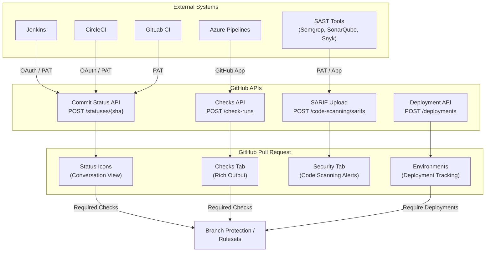

# Third-Party Integrations and Status API

**Level:** L300 (Advanced)  
**Objective:** Configure and manage third-party CI/CD integrations, commit statuses, check runs, deployment tracking, and SARIF-based code scanning through the GitHub REST API

## Overview

GitHub provides two complementary mechanisms for external systems to report CI/CD results, code quality scans, and other automated analyses back to commits and pull requests: the **Commit Status API** (the original, simpler approach) and the **Checks API** (the modern, richer approach). Both surface results directly in the pull request UI and can be enforced as merge requirements through **branch protection rules** or **repository rulesets**.

Beyond CI status reporting, GitHub's integration surface includes the **Deployment Status API** for tracking releases across environments, the **SARIF upload endpoint** for ingesting third-party static analysis results into Code Scanning, and a comprehensive **webhook system** for event-driven automation.

For GHEC administrators, understanding these APIs is critical because:

- Many legacy and external CI tools still use the Commit Status API
- The Checks API is the recommended path for new integrations built as GitHub Apps
- Required status checks in branch protection and rulesets can enforce either type
- Deployment environments and SARIF uploads extend governance beyond simple pass/fail gates



## Commit Status API

The Commit Status API is the original mechanism for reporting build and test results to GitHub. It provides a simple, stateless interface that any authenticated user or integration with write access can use.

### Status States

Each commit status has exactly one of four states:

| State | Icon | Description | Use Case |
|-------|------|-------------|----------|
| `pending` | 🟡 | Analysis is in progress | CI build started |
| `success` | 🟢 | Analysis completed successfully | All tests passed |
| `failure` | 🔴 | Analysis found problems | Tests failed, lint errors |
| `error` | 🔴 | Infrastructure error occurred | CI server unreachable, timeout |

> **L300 Note:** The distinction between `failure` and `error` is semantic. Use `failure` when the code itself has problems (tests fail, lint violations). Use `error` when the CI infrastructure encounters problems (runner crash, timeout, configuration error).

### Context Strings

The **context** field is a unique identifier string that distinguishes one status from another on the same commit. Multiple contexts can coexist per commit, each representing a different check or analysis tool.

**Common context naming patterns:**

| Context String | Tool |
|----------------|------|
| `continuous-integration/jenkins` | Jenkins |
| `ci/circleci: build` | CircleCI |
| `continuous-integration/travis-ci/pr` | Travis CI |
| `codeclimate` | Code Climate |
| `security/snyk` | Snyk |
| `ci/custom-build` | Custom CI |

**Naming conventions:**

- Use a namespace prefix (e.g., `ci/`, `security/`, `quality/`)
- Keep context strings stable — changing them breaks required status check configurations
- Use lowercase with hyphens or slashes for readability

### Combined Status Rules

GitHub computes an **overall combined status** for each commit by evaluating all status contexts. The combined state follows strict precedence rules:

1. If **any** context reports `error` or `failure` → combined state is **`failure`**
2. If **any** context reports `pending` → combined state is **`pending`**
3. If **all** contexts report `success` (or no statuses exist) → combined state is **`success`**

```bash
# Get the combined status for a ref
gh api repos/OWNER/REPO/commits/main/status \
  --jq '{state: .state, total: .total_count, statuses: [.statuses[] | {context, state}]}'
```

Example combined status response:

```json
{
  "state": "failure",
  "total": 3,
  "statuses": [
    { "context": "ci/build", "state": "success" },
    { "context": "ci/test", "state": "failure" },
    { "context": "security/scan", "state": "success" }
  ]
}
```

### Creating and Reading Commit Statuses

**Create a commit status** (`POST /repos/{owner}/{repo}/statuses/{sha}`):

```bash
# Using curl
curl -L -X POST \
  -H "Accept: application/vnd.github+json" \
  -H "Authorization: Bearer <TOKEN>" \
  https://api.github.com/repos/OWNER/REPO/statuses/SHA \
  -d '{
    "state": "success",
    "target_url": "https://ci.example.com/1000/output",
    "description": "Build has completed successfully",
    "context": "continuous-integration/jenkins"
  }'

# Using gh CLI
gh api repos/OWNER/REPO/statuses/$(git rev-parse HEAD) \
  -f state="pending" \
  -f description="Build is running..." \
  -f context="ci/custom-build" \
  -f target_url="https://ci.example.com/build/42"
```

**Get combined status** (`GET /repos/{owner}/{repo}/commits/{ref}/status`):

```bash
# Get combined status for a branch
gh api repos/OWNER/REPO/commits/main/status

# Get combined status for a specific SHA
curl -L \
  -H "Accept: application/vnd.github+json" \
  -H "Authorization: Bearer <TOKEN>" \
  https://api.github.com/repos/OWNER/REPO/commits/abc123def/status
```

**List all statuses for a ref** (`GET /repos/{owner}/{repo}/commits/{ref}/statuses`):

```bash
# List all status entries (includes historical entries)
gh api repos/OWNER/REPO/commits/main/statuses --paginate \
  --jq '.[] | {context, state, description, created_at}'
```

### Status Object Fields

| Field | Type | Description |
|-------|------|-------------|
| `state` | string | **Required.** `error`, `failure`, `pending`, or `success` |
| `target_url` | string | URL linking to the full build output |
| `description` | string | Short human-readable description (max 140 characters) |
| `context` | string | Unique identifier for this status (default: `default`) |

### Permissions and Immutability

**Permissions:** Anyone with **write access** to a repository can create commit statuses. The required OAuth scope is `repo:status` (or `repo` for full access).

**Immutability:** Statuses are immutable — each POST creates a **new** status entry. The combined status endpoint aggregates results by taking the **latest** status per unique context string. Previous entries remain in the history and are accessible via the list endpoint.

```bash
# Demonstrate immutability: posting two statuses for the same context
# First: pending
gh api repos/OWNER/REPO/statuses/$(git rev-parse HEAD) \
  -f state="pending" -f context="ci/build" \
  -f description="Build started"

# Second: success (creates a new entry, does not overwrite)
gh api repos/OWNER/REPO/statuses/$(git rev-parse HEAD) \
  -f state="success" -f context="ci/build" \
  -f description="Build passed"

# List shows both entries (newest first)
gh api repos/OWNER/REPO/commits/$(git rev-parse HEAD)/statuses \
  --jq '.[] | select(.context == "ci/build") | {state, description, created_at}'
```

## Check Runs and Check Suites

The Checks API is the modern replacement for commit statuses, offering significantly richer reporting capabilities. It is **exclusively available to GitHub Apps** — OAuth apps and personal access tokens can read but not create check runs.

### Check Suite Lifecycle

A **check suite** is a collection of check runs created by a single GitHub App for a specific commit. GitHub manages the lifecycle automatically:

1. **Code pushed** → GitHub automatically creates a check suite for each installed GitHub App with `checks:write` permission
2. **`check_suite` webhook** (action: `requested`) → dispatched to the GitHub App
3. **App creates check runs** → one or more check runs within the suite
4. **Check runs execute** → statuses update from `queued` → `in_progress` → `completed`
5. **User re-runs** → triggers a new `check_suite` event (action: `rerequested`)

GitHub Actions automatically creates check suites and check runs for every workflow execution. Each workflow **job** becomes a separate check run, named `Workflow Name / Job Name`.

### Check Run Statuses and Conclusions

Check runs use a two-level model: a **status** field tracks progress, and a **conclusion** field records the final result.

**Statuses:**

| Status | Description |
|--------|-------------|
| `queued` | Check run has been queued |
| `in_progress` | Check run is actively executing |
| `completed` | Check run finished (has a conclusion) |
| `pending` | Concurrency limit reached (Actions only) |
| `waiting` | Waiting for deployment protection rule (Actions only) |
| `requested` | Created but not yet queued (Actions only) |

**Conclusions (set when status is `completed`):**

| Conclusion | Description | Blocks Merge? |
|------------|-------------|:---:|
| `success` | Completed successfully | No |
| `failure` | Check run failed | Yes |
| `neutral` | Completed with neutral result | No |
| `cancelled` | Cancelled before completion | Yes |
| `timed_out` | Check run timed out | Yes |
| `action_required` | Manual action needed | Yes |
| `skipped` | Skipped (e.g., path filter) | No |
| `stale` | Incomplete for > 14 days | Yes |

> **L300 Note:** `neutral` and `skipped` conclusions are treated as passing for required status checks and will not block merging.

### Annotations

Check runs can attach **annotations** to specific lines of code, visible in both the Checks tab and the Files Changed tab of a pull request. Annotations are one of the most powerful features distinguishing the Checks API from commit statuses.

| Field | Required | Description |
|-------|:---:|-------------|
| `path` | ✓ | File path relative to repo root (e.g., `src/main.js`) |
| `start_line` | ✓ | Starting line number |
| `end_line` | ✓ | Ending line number |
| `annotation_level` | ✓ | `notice`, `warning`, or `failure` |
| `message` | ✓ | Detailed description (max 64 KB) |
| `title` | | Short title for the annotation (max 255 characters) |

**Limits:**

- Maximum **50 annotations per API request**
- Annotations are **appended** on update calls, not replaced — work around the limit with multiple PATCH requests
- GitHub Actions has a further limit of **10 warning + 10 error** annotations per step

### Requested Actions

Check runs can include interactive **action buttons** that appear in the Checks tab. When a user clicks a button, GitHub sends a `check_run` webhook with action `requested_action` back to the GitHub App, enabling automated remediation flows.

```json
{
  "actions": [
    {
      "label": "Fix this",
      "description": "Automatically apply the suggested fix",
      "identifier": "fix_it"
    }
  ]
}
```

### Check Run API Endpoints

**Create a check run** (`POST /repos/{owner}/{repo}/check-runs`):

```bash
# Create a check run (GitHub App token required)
curl -L -X POST \
  -H "Accept: application/vnd.github+json" \
  -H "Authorization: Bearer <APP-TOKEN>" \
  https://api.github.com/repos/OWNER/REPO/check-runs \
  -d '{
    "name": "code-quality",
    "head_sha": "ce587453ced02b1526dfb4cb910479d431683101",
    "status": "in_progress",
    "started_at": "2024-01-15T10:00:00Z",
    "output": {
      "title": "Code Quality Report",
      "summary": "Analysis in progress..."
    }
  }'

# Using gh CLI
gh api repos/OWNER/REPO/check-runs \
  -X POST \
  -f name="code-quality" \
  -f head_sha="$(git rev-parse HEAD)" \
  -f status="in_progress" \
  -f "output[title]=Code Quality Report" \
  -f "output[summary]=Analysis in progress..."
```

**Update a check run with conclusion and annotations** (`PATCH /repos/{owner}/{repo}/check-runs/{check_run_id}`):

```bash
curl -L -X PATCH \
  -H "Accept: application/vnd.github+json" \
  -H "Authorization: Bearer <APP-TOKEN>" \
  https://api.github.com/repos/OWNER/REPO/check-runs/CHECK_RUN_ID \
  -d '{
    "status": "completed",
    "conclusion": "failure",
    "completed_at": "2024-01-15T10:05:00Z",
    "output": {
      "title": "Code Quality Report",
      "summary": "Found 2 issues in src/main.js",
      "annotations": [
        {
          "path": "src/main.js",
          "start_line": 42,
          "end_line": 42,
          "annotation_level": "failure",
          "title": "Unused variable",
          "message": "Variable `tempData` is declared but never used."
        },
        {
          "path": "src/main.js",
          "start_line": 87,
          "end_line": 89,
          "annotation_level": "warning",
          "title": "Missing error handling",
          "message": "Promise chain missing .catch() handler."
        }
      ]
    }
  }'
```

**List check runs for a ref** (`GET /repos/{owner}/{repo}/commits/{ref}/check-runs`):

```bash
gh api repos/OWNER/REPO/commits/main/check-runs \
  --jq '.check_runs[] | {name, status, conclusion, app: .app.name}'
```

### Permissions and Retention

**Permissions:**

- **Creating/updating** check runs requires `checks:write` (GitHub App only)
- **Reading** check runs requires `checks:read` or `repo` scope (any token type)

**Retention:**

- GitHub retains checks data for **400 days**
- After 400 + 10 days (archival period), data is permanently deleted
- Required checks that are archived must be **re-run** before merging

## Required Status Checks

Required status checks prevent pull requests from merging until specified checks or commit statuses pass. They are configured through **branch protection rules** or **repository rulesets**.

### Branch Protection Rules

Branch protection rules are the original mechanism for enforcing status checks:

- Configured per-branch or with `fnmatch` patterns (e.g., `release-*`, `**/main`)
- Only **one** branch protection rule applies at a time per branch
- Admins can bypass by default unless "Do not allow bypassing" is enabled
- Required statuses must report `success`, `skipped`, or `neutral` to allow merge

**Configuration via API:**

```bash
# Set required status checks on a branch
curl -L -X PUT \
  -H "Accept: application/vnd.github+json" \
  -H "Authorization: Bearer <TOKEN>" \
  https://api.github.com/repos/OWNER/REPO/branches/main/protection \
  -d '{
    "required_status_checks": {
      "strict": true,
      "contexts": ["ci/build", "ci/test", "security/scan"]
    },
    "enforce_admins": true,
    "required_pull_request_reviews": null,
    "restrictions": null
  }'

# Using gh CLI
gh api repos/OWNER/REPO/branches/main/protection \
  -X PUT \
  -f required_status_checks[strict]=true \
  -f required_status_checks[contexts][]=ci/build \
  -f required_status_checks[contexts][]=ci/test \
  -f enforce_admins=true
```

### Repository Rulesets

Repository rulesets are the **recommended approach** for GHEC environments, offering significant advantages over branch protection rules:

- **Multiple rulesets** can apply simultaneously (layered enforcement)
- **Bypass lists** with specific roles, teams, or GitHub Apps
- Available at both **repository and organization level** in GHEC
- Can **pin a required check to a specific GitHub App source** for security
- Audit log integration for compliance tracking

```bash
# Create a ruleset with required status checks via API
gh api repos/OWNER/REPO/rulesets \
  -X POST \
  --input - <<'EOF'
{
  "name": "CI Required Checks",
  "target": "branch",
  "enforcement": "active",
  "conditions": {
    "ref_name": {
      "include": ["refs/heads/main", "refs/heads/release-*"],
      "exclude": []
    }
  },
  "rules": [
    {
      "type": "required_status_checks",
      "parameters": {
        "strict_required_status_checks_policy": true,
        "required_status_checks": [
          {
            "context": "CI / build-and-test",
            "integration_id": 15368
          }
        ]
      }
    }
  ],
  "bypass_actors": [
    {
      "actor_id": 1,
      "actor_type": "OrganizationAdmin",
      "bypass_mode": "always"
    }
  ]
}
EOF
```

> **L300 Note:** The `integration_id` field pins the required check to a specific GitHub App. If the status is set by any other person or integration, merging is not allowed. This prevents unauthorized status spoofing.

### Strict vs. Loose Mode

| Mode | Behavior | Trade-off |
|------|----------|-----------|
| **Strict** (`strict: true`) | Branch must be up to date with the base branch before merging | More CI builds triggered, but guarantees no integration regressions |
| **Loose** (`strict: false`) | Branch does not need to be up to date | Fewer builds, but risk of incompatible changes post-merge |

**Recommendation:** Use strict mode for `main` and release branches. Use loose mode for high-velocity feature branches where merge queues handle integration validation.

### Pinning Checks to GitHub App Sources

When configuring required checks in rulesets, you can specify the exact GitHub App that must provide the status:

- The app must be **installed** in the repository with `statuses:write` permission
- The app must have **recently submitted** a check run or status for that context
- This prevents a malicious actor with write access from spoofing a passing status via the Commit Status API

> **Important for Actions:** If you use branch protection rules that require specific status checks, ensure job names are **unique across all workflows**. Duplicate job names in multiple workflows cause ambiguous status check results and can block merging.

## Integrating External CI/CD

External CI/CD tools integrate with GitHub using webhook-triggered, report-back patterns. The CI system receives push or pull request events, runs builds, and reports results back through the Status or Checks API.

### Jenkins

Jenkins uses the **Commit Status API** through the GitHub plugin:

1. **Webhook trigger:** GitHub sends a `push` or `pull_request` webhook to Jenkins
2. **Pending status:** Jenkins sets commit status to `pending` with context `continuous-integration/jenkins`
3. **Build execution:** Jenkins runs the configured pipeline
4. **Result reporting:** Jenkins sets status to `success` or `failure` with `target_url` pointing to the build output

```bash
# Simulating Jenkins status reporting from a pipeline script
# Step 1: Set pending
curl -X POST \
  -H "Authorization: token ${GITHUB_TOKEN}" \
  "https://api.github.com/repos/${OWNER}/${REPO}/statuses/${GIT_COMMIT}" \
  -d "{
    \"state\": \"pending\",
    \"target_url\": \"${BUILD_URL}\",
    \"description\": \"Jenkins build #${BUILD_NUMBER} started\",
    \"context\": \"continuous-integration/jenkins\"
  }"

# Step 2: Set result after build completes
curl -X POST \
  -H "Authorization: token ${GITHUB_TOKEN}" \
  "https://api.github.com/repos/${OWNER}/${REPO}/statuses/${GIT_COMMIT}" \
  -d "{
    \"state\": \"success\",
    \"target_url\": \"${BUILD_URL}console\",
    \"description\": \"Jenkins build #${BUILD_NUMBER} passed\",
    \"context\": \"continuous-integration/jenkins\"
  }"
```

### CircleCI

CircleCI supports both the **Commit Status API** and **Checks API** (via its GitHub App integration):

- **OAuth integration:** Reports via commit statuses with context `ci/circleci: <job-name>`
- **GitHub App integration:** Reports via check runs with rich output and annotations
- Triggered by `push` and `pull_request` webhooks
- Supports workflow-level and job-level status reporting

```yaml
# .circleci/config.yml — CircleCI reports status automatically
version: 2.1
workflows:
  build-and-test:
    jobs:
      - build    # Reports as "ci/circleci: build"
      - test:    # Reports as "ci/circleci: test"
          requires:
            - build
```

### GitLab CI

GitLab CI can report results to GitHub when mirroring or using GitHub as the source repository:

- Uses **personal access tokens** or **project tokens** with `repo:status` scope
- Reports via the Commit Status API
- Requires explicit configuration in `.gitlab-ci.yml` or through mirroring settings

```bash
# Report GitLab CI results to GitHub from a pipeline job
curl -X POST \
  -H "Authorization: token ${GITHUB_TOKEN}" \
  "https://api.github.com/repos/${GITHUB_OWNER}/${GITHUB_REPO}/statuses/${CI_COMMIT_SHA}" \
  -d "{
    \"state\": \"$([ $CI_JOB_STATUS = 'success' ] && echo 'success' || echo 'failure')\",
    \"target_url\": \"${CI_PIPELINE_URL}\",
    \"description\": \"GitLab pipeline ${CI_PIPELINE_ID}\",
    \"context\": \"ci/gitlab\"
  }"
```

### Azure Pipelines

Azure Pipelines integrates as a **GitHub App** through the Azure Pipelines marketplace app, using the Checks API for rich reporting:

- Installs as a GitHub App with `checks:write` permission
- Creates detailed check runs with build logs and test results
- Supports required status checks in branch protection and rulesets
- Triggers on `push`, `pull_request`, and `check_suite` events

```yaml
# azure-pipelines.yml — Status reported automatically via GitHub App
trigger:
  branches:
    include:
      - main
      - release/*

pr:
  branches:
    include:
      - main

pool:
  vmImage: 'ubuntu-latest'

steps:
  - script: npm ci
    displayName: 'Install dependencies'
  - script: npm test
    displayName: 'Run tests'
  - script: npm run build
    displayName: 'Build project'
```

### GitHub Actions as Native CI

GitHub Actions generates check runs automatically. Each workflow job becomes a check run named `Workflow Name / Job Name`:

```yaml
# .github/workflows/ci.yml
name: CI
on:
  pull_request:
    branches: [main]
jobs:
  build-and-test:  # Check name: "CI / build-and-test"
    runs-on: ubuntu-latest
    steps:
      - uses: actions/checkout@v4
      - run: npm ci
      - run: npm test
      - run: npm run build
```

**Reporting additional commit statuses from Actions:**

```yaml
# Report custom commit status from within a workflow
- name: Report external status
  run: |
    gh api repos/${{ github.repository }}/statuses/${{ github.sha }} \
      -f state="success" \
      -f target_url="https://example.com/results" \
      -f description="Custom analysis passed" \
      -f context="custom/analysis"
  env:
    GH_TOKEN: ${{ secrets.GITHUB_TOKEN }}
```

## SARIF Upload for Code Scanning

The **Static Analysis Results Interchange Format (SARIF)** is an OASIS standard for the output of static analysis tools. GitHub's Code Scanning feature accepts SARIF v2.1.0 uploads, enabling any third-party SAST tool to surface results as code scanning alerts.

### SARIF v2.1.0 Schema

SARIF files follow the OASIS SARIF v2.1.0 JSON schema. Key structural elements:

| Element | Description |
|---------|-------------|
| `$schema` | Must reference the SARIF v2.1.0 schema |
| `version` | Must be `"2.1.0"` |
| `runs[]` | Array of analysis runs |
| `runs[].tool` | Tool metadata (name, version, rules) |
| `runs[].results[]` | Array of findings with location, message, and severity |
| `runs[].tool.driver.rules[]` | Rule definitions with IDs, descriptions, and help text |

**Minimal SARIF structure:**

```json
{
  "$schema": "https://raw.githubusercontent.com/oasis-tcs/sarif-spec/main/sarif-2.1/schema/sarif-schema-2.1.0.json",
  "version": "2.1.0",
  "runs": [
    {
      "tool": {
        "driver": {
          "name": "CustomScanner",
          "version": "1.0.0",
          "rules": [
            {
              "id": "CUSTOM001",
              "shortDescription": { "text": "Hardcoded credentials" },
              "fullDescription": { "text": "Credentials should not be hardcoded in source files." },
              "defaultConfiguration": { "level": "error" }
            }
          ]
        }
      },
      "results": [
        {
          "ruleId": "CUSTOM001",
          "level": "error",
          "message": { "text": "Hardcoded API key detected" },
          "locations": [
            {
              "physicalLocation": {
                "artifactLocation": { "uri": "src/config.js" },
                "region": { "startLine": 15, "startColumn": 10 }
              }
            }
          ]
        }
      ]
    }
  ]
}
```

### Uploading SARIF Results

Upload SARIF results via the Code Scanning API endpoint (`POST /repos/{owner}/{repo}/code-scanning/sarifs`). The SARIF content must be **gzip-compressed and base64-encoded**.

```bash
# Compress and encode the SARIF file
SARIF_CONTENT=$(gzip -c results.sarif | base64 -w 0)

# Upload via curl
curl -L -X POST \
  -H "Accept: application/vnd.github+json" \
  -H "Authorization: Bearer <TOKEN>" \
  https://api.github.com/repos/OWNER/REPO/code-scanning/sarifs \
  -d "{
    \"commit_sha\": \"$(git rev-parse HEAD)\",
    \"ref\": \"refs/heads/main\",
    \"sarif\": \"${SARIF_CONTENT}\"
  }"

# Upload via gh CLI
gh api repos/OWNER/REPO/code-scanning/sarifs \
  -f commit_sha="$(git rev-parse HEAD)" \
  -f ref="refs/heads/main" \
  -f sarif="$(gzip -c results.sarif | base64 -w 0)"
```

**Upload from GitHub Actions:**

```yaml
# Upload SARIF from a workflow using the official action
- name: Upload SARIF results
  uses: github/codeql-action/upload-sarif@v3
  with:
    sarif_file: results.sarif
    category: custom-scanner
```

### Third-Party SAST Tool Integration

Common third-party tools that produce SARIF output for GitHub Code Scanning:

#### Semgrep

```yaml
# .github/workflows/semgrep.yml
name: Semgrep
on: [push, pull_request]
jobs:
  semgrep:
    runs-on: ubuntu-latest
    steps:
      - uses: actions/checkout@v4
      - name: Run Semgrep
        run: |
          pip install semgrep
          semgrep --config auto --sarif --output semgrep.sarif .
      - name: Upload SARIF
        uses: github/codeql-action/upload-sarif@v3
        with:
          sarif_file: semgrep.sarif
          category: semgrep
```

#### SonarQube

```bash
# Export SonarQube results as SARIF and upload
sonar-scanner \
  -Dsonar.projectKey=my-project \
  -Dsonar.host.url=https://sonarqube.example.com

# Use the SonarQube SARIF exporter or a conversion tool
# Then upload the resulting SARIF file
gh api repos/OWNER/REPO/code-scanning/sarifs \
  -f commit_sha="$(git rev-parse HEAD)" \
  -f ref="refs/heads/$(git branch --show-current)" \
  -f sarif="$(gzip -c sonar-results.sarif | base64 -w 0)"
```

#### Snyk

```yaml
# .github/workflows/snyk.yml
name: Snyk Security
on: [push, pull_request]
jobs:
  snyk:
    runs-on: ubuntu-latest
    steps:
      - uses: actions/checkout@v4
      - name: Run Snyk
        uses: snyk/actions/node@master
        continue-on-error: true
        env:
          SNYK_TOKEN: ${{ secrets.SNYK_TOKEN }}
        with:
          args: --sarif-file-output=snyk.sarif
      - name: Upload SARIF
        uses: github/codeql-action/upload-sarif@v3
        with:
          sarif_file: snyk.sarif
          category: snyk
```

## Deployment Status API

The Deployment API provides a mechanism to track deployments through GitHub, decoupling deployment requests from the actual deployment execution. This enables environment tracking, deployment gates, and integration with branch protection.

### Deployment Objects

A **deployment** is a request to deploy a specific ref (branch, SHA, or tag) to a named environment. Creating a deployment dispatches a `deployment` webhook event that external systems can consume.

**Key deployment fields:**

| Field | Type | Description |
|-------|------|-------------|
| `ref` | string | The ref to deploy (branch, SHA, tag) |
| `environment` | string | Target environment name (e.g., `production`, `staging`) |
| `description` | string | Human-readable description of the deployment |
| `payload` | string/object | Custom data passed to the deployment handler |
| `auto_merge` | boolean | Whether to merge the default branch into the ref (default: `true`) |
| `required_contexts` | array | Status contexts that must pass before deploying |

```bash
# Create a deployment
curl -L -X POST \
  -H "Accept: application/vnd.github+json" \
  -H "Authorization: Bearer <TOKEN>" \
  https://api.github.com/repos/OWNER/REPO/deployments \
  -d '{
    "ref": "main",
    "environment": "production",
    "description": "Deploy v2.1.0 to production",
    "payload": {"version": "2.1.0", "deployer": "release-bot"},
    "required_contexts": ["ci/build", "ci/test"]
  }'

# Using gh CLI
gh api repos/OWNER/REPO/deployments \
  -f ref="main" \
  -f environment="staging" \
  -f description="Deploy to staging" \
  -f auto_merge=false
```

### Deployment Statuses

External services update deployment progress by posting **deployment statuses**. Each status has a state that tracks the deployment through its lifecycle:

| State | Description |
|-------|-------------|
| `queued` | Deployment is queued for processing |
| `pending` | Deployment is pending (waiting to start) |
| `in_progress` | Deployment is actively running |
| `success` | Deployment completed successfully |
| `failure` | Deployment failed |
| `error` | Infrastructure error during deployment |
| `inactive` | Deployment is no longer active (superseded) |

```bash
# Create a deployment status
curl -L -X POST \
  -H "Accept: application/vnd.github+json" \
  -H "Authorization: Bearer <TOKEN>" \
  https://api.github.com/repos/OWNER/REPO/deployments/DEPLOYMENT_ID/statuses \
  -d '{
    "state": "success",
    "log_url": "https://example.com/deployment/42/output",
    "description": "Deployment finished successfully.",
    "environment": "production",
    "environment_url": "https://app.example.com"
  }'

# Using gh CLI
gh api repos/OWNER/REPO/deployments/DEPLOYMENT_ID/statuses \
  -f state="in_progress" \
  -f log_url="https://deploy.example.com/logs/42" \
  -f description="Deployment in progress..."
```

### Environment Tracking

GitHub tracks the **active deployment** for each environment. Key behaviors:

- When a deployment state is set to `success`, all prior non-transient, non-production deployments in the same environment become `inactive` automatically
- Set `auto_inactive: false` to prevent this behavior
- Environments appear in the repository sidebar and pull request deployment section
- Branch protection can require deployments to succeed in specific environments before merging

```bash
# List deployments for a specific environment
gh api repos/OWNER/REPO/deployments \
  --jq '[.[] | select(.environment == "staging") | {id, ref, description, created_at}]'

# Get deployment statuses for a specific deployment
gh api repos/OWNER/REPO/deployments/DEPLOYMENT_ID/statuses \
  --jq '.[] | {state, description, created_at, environment_url}'
```

### Deployment as a Merge Gate

The "Require deployments to succeed before merging" branch protection rule ensures changes are successfully deployed to specific environments before the branch can be merged:

```bash
# Configure branch protection to require staging deployment
gh api repos/OWNER/REPO/branches/main/protection \
  -X PUT \
  --input - <<'EOF'
{
  "required_status_checks": {
    "strict": true,
    "contexts": ["ci/build"]
  },
  "required_deployments": {
    "environments": ["staging"]
  },
  "enforce_admins": true,
  "required_pull_request_reviews": null,
  "restrictions": null
}
EOF
```

## Webhooks for Integration

Webhooks are the primary mechanism for GitHub to notify external systems about events. Understanding webhook configuration, payload structure, and security is essential for building reliable integrations.

### Key Webhook Events

The following events are most relevant for CI/CD and status integrations:

| Event | Trigger | Key Actions |
|-------|---------|-------------|
| `check_run` | Check run created, completed, rerequested, or action requested | `created`, `completed`, `rerequested`, `requested_action` |
| `check_suite` | Check suite requested, completed, or rerequested | `requested`, `completed`, `rerequested` |
| `status` | Commit status created | N/A (fires on every status creation) |
| `deployment` | Deployment created | `created` |
| `deployment_status` | Deployment status updated | `created` |
| `push` | Commits pushed to a branch | N/A |
| `pull_request` | Pull request opened, synchronized, or updated | `opened`, `synchronize`, `reopened`, `closed` |
| `workflow_run` | GitHub Actions workflow requested or completed | `requested`, `completed`, `in_progress` |

### Payload Structure

All webhook payloads share a common structure with event-specific fields:

```json
{
  "action": "completed",
  "check_run": {
    "id": 4,
    "head_sha": "ce587453ced02b1526dfb4cb910479d431683101",
    "status": "completed",
    "conclusion": "success",
    "name": "mighty_readme",
    "check_suite": { "id": 5 },
    "app": { "id": 1, "name": "Octocat CI" },
    "output": {
      "title": "Mighty Readme report",
      "summary": "All checks passed",
      "annotations_count": 0
    }
  },
  "repository": { "id": 1, "full_name": "octocat/Hello-World" },
  "organization": { "id": 2, "login": "octocat-org" },
  "sender": { "id": 1, "login": "octocat" },
  "installation": { "id": 1 }
}
```

**Key headers delivered with each webhook:**

| Header | Description |
|--------|-------------|
| `X-GitHub-Event` | Event type (e.g., `check_run`, `status`) |
| `X-GitHub-Delivery` | Unique GUID for this delivery |
| `X-Hub-Signature-256` | HMAC-SHA256 hex digest of the payload |
| `X-GitHub-Hook-ID` | Webhook configuration ID |
| `X-GitHub-Hook-Installation-Target-ID` | Target repository or organization ID |

### Webhook Security

Verify webhook authenticity using **HMAC-SHA256** signatures to prevent spoofed payloads:

```bash
# Webhook secret configured in GitHub
WEBHOOK_SECRET="your-webhook-secret"

# Compute expected signature
EXPECTED_SIG="sha256=$(echo -n "$PAYLOAD" | openssl dgst -sha256 -hmac "$WEBHOOK_SECRET" | cut -d' ' -f2)"

# Compare with X-Hub-Signature-256 header (use constant-time comparison)
```

**Node.js verification example:**

```javascript
const crypto = require('crypto');

function verifyWebhookSignature(payload, signature, secret) {
  const expected = 'sha256=' +
    crypto.createHmac('sha256', secret)
      .update(payload, 'utf-8')
      .digest('hex');

  return crypto.timingSafeEqual(
    Buffer.from(signature),
    Buffer.from(expected)
  );
}
```

**Security best practices:**

- Always verify the `X-Hub-Signature-256` header before processing
- Use **constant-time comparison** to prevent timing attacks
- Rotate webhook secrets periodically
- Use HTTPS endpoints exclusively
- Validate the `X-GitHub-Event` header matches expected event types

### Webhook Proxy for Development

During local development, use a webhook proxy to forward GitHub events to your local machine:

```bash
# Using smee.io (GitHub's recommended webhook proxy)
npx smee-client \
  --url https://smee.io/your-channel-id \
  --path /webhook \
  --port 3000

# Or use the GitHub CLI webhook forwarding (requires gh extension)
gh webhook forward \
  --events=check_run,check_suite,status \
  --repo=OWNER/REPO \
  --url=http://localhost:3000/webhook
```

### Configuring Webhooks via API

```bash
# Create a repository webhook
gh api repos/OWNER/REPO/hooks \
  -X POST \
  -f name="web" \
  -f active=true \
  -f config[url]="https://ci.example.com/webhook" \
  -f config[content_type]="json" \
  -f config[secret]="your-webhook-secret" \
  -f events[]=push \
  -f events[]=pull_request \
  -f events[]=check_run

# Create an organization webhook
gh api orgs/ORG/hooks \
  -X POST \
  -f name="web" \
  -f active=true \
  -f config[url]="https://ci.example.com/org-webhook" \
  -f config[content_type]="json" \
  -f config[secret]="your-webhook-secret" \
  -f events[]=status \
  -f events[]=deployment \
  -f events[]=deployment_status

# List recent webhook deliveries
gh api repos/OWNER/REPO/hooks/HOOK_ID/deliveries \
  --jq '.[] | {id, status_code, event, delivered_at}'

# Redeliver a failed webhook
gh api repos/OWNER/REPO/hooks/HOOK_ID/deliveries/DELIVERY_ID/attempts \
  -X POST
```

## Best Practices

### Naming Conventions for Contexts

Consistent context naming ensures clarity in the PR status checks list and simplifies required check configuration:

| Pattern | Example | Notes |
|---------|---------|-------|
| `ci/<tool>` | `ci/jenkins`, `ci/build` | General CI checks |
| `ci/<tool>: <job>` | `ci/circleci: build` | Tool-specific job names |
| `security/<tool>` | `security/snyk`, `security/codeql` | Security scanners |
| `quality/<tool>` | `quality/sonarqube`, `quality/codeclimate` | Code quality tools |
| `deploy/<env>` | `deploy/staging`, `deploy/production` | Deployment statuses |
| `Workflow Name / Job Name` | `CI / build-and-test` | GitHub Actions (automatic) |

**Guidelines:**

- Use lowercase with hyphens and slashes
- Namespace by category (`ci/`, `security/`, `quality/`, `deploy/`)
- Keep context strings **stable** — changing them requires updating branch protection rules
- Document all context strings in a central team wiki or `CONTRIBUTING.md`

### Idempotency and Error Handling

Design integrations to handle failures gracefully and avoid duplicate processing:

- **Idempotent status reporting:** POST the same status multiple times safely (statuses are append-only, combined status uses latest per context)
- **Retry with backoff:** Implement exponential backoff for transient API failures (5xx responses)
- **Webhook deduplication:** Track `X-GitHub-Delivery` GUIDs to detect and skip duplicate deliveries
- **Graceful degradation:** If the status API is unreachable, log the failure and retry — don't block the CI pipeline

```bash
# Retry logic for status reporting (shell example)
MAX_RETRIES=3
RETRY_DELAY=5

for i in $(seq 1 $MAX_RETRIES); do
  HTTP_STATUS=$(curl -s -o /dev/null -w "%{http_code}" -X POST \
    -H "Authorization: token ${GITHUB_TOKEN}" \
    "https://api.github.com/repos/${OWNER}/${REPO}/statuses/${SHA}" \
    -d '{"state":"success","context":"ci/build","description":"Build passed"}')

  if [ "$HTTP_STATUS" -eq 201 ]; then
    echo "Status reported successfully"
    break
  fi

  echo "Attempt $i failed (HTTP $HTTP_STATUS), retrying in ${RETRY_DELAY}s..."
  sleep $RETRY_DELAY
  RETRY_DELAY=$((RETRY_DELAY * 2))
done
```

### Rate Limiting

GitHub enforces rate limits on API calls. Plan integrations accordingly:

| Authentication | Rate Limit | Window |
|----------------|------------|--------|
| Personal Access Token | 5,000 requests | Per hour |
| GitHub App installation | 5,000 requests (or more based on repos) | Per hour |
| OAuth app (on behalf of user) | 5,000 requests | Per hour |
| Unauthenticated | 60 requests | Per hour |

**Mitigation strategies:**

- Check `X-RateLimit-Remaining` and `X-RateLimit-Reset` headers
- Use conditional requests (`If-None-Match` / `If-Modified-Since`) to avoid unnecessary consumption
- Batch operations where possible (e.g., update annotations in fewer, larger requests)
- Use webhooks for event-driven workflows instead of polling

```bash
# Check current rate limit status
gh api rate_limit --jq '{
  core: {remaining: .resources.core.remaining, reset: (.resources.core.reset | todate)},
  checks: {remaining: .resources.checks?.remaining, reset: (.resources.checks?.reset | todate)}
}'
```

### Token Security

Secure API tokens and webhook secrets with defense-in-depth practices:

- **Least privilege:** Use fine-grained PATs or GitHub App tokens scoped to minimum required permissions
- **Short-lived tokens:** Prefer GitHub App installation tokens (1-hour expiry) over long-lived PATs
- **Secret management:** Store tokens in CI/CD secret managers — never in code, config files, or environment variables in logs
- **Rotation schedule:** Rotate webhook secrets and PATs on a regular cadence (90 days recommended)
- **Audit trail:** Monitor token usage through the organization audit log and security log

```bash
# Create a fine-grained PAT with minimal permissions via the API
# (Typically done through the GitHub UI at Settings > Developer settings)

# List GitHub App installations to audit token scope
gh api app/installations --jq '.[] | {id, account: .account.login, permissions}'

# Check token scopes for a PAT
curl -sI -H "Authorization: token <TOKEN>" \
  https://api.github.com/users/octocat \
  | grep -i "x-oauth-scopes"
```

## References

1. [REST API — Commit Statuses](https://docs.github.com/en/rest/commits/statuses)
2. [About Status Checks](https://docs.github.com/en/pull-requests/collaborating-with-pull-requests/collaborating-on-repositories-with-code-quality-features/about-status-checks)
3. [Available Rules for Rulesets](https://docs.github.com/en/repositories/configuring-branches-and-merges-in-your-repository/managing-rulesets/available-rules-for-rulesets)
4. [REST API — Check Runs](https://docs.github.com/en/rest/checks/runs)
5. [Using the REST API to Interact with Checks](https://docs.github.com/en/rest/guides/using-the-rest-api-to-interact-with-checks)
6. [About Protected Branches](https://docs.github.com/en/repositories/configuring-branches-and-merges-in-your-repository/managing-protected-branches/about-protected-branches)
7. [Using GitHub CLI in Workflows](https://docs.github.com/en/actions/writing-workflows/choosing-what-your-workflow-does/using-github-cli-in-workflows)
8. [Adding a Workflow Status Badge](https://docs.github.com/en/actions/monitoring-and-troubleshooting-workflows/monitoring-workflows/adding-a-workflow-status-badge)
9. [REST API — Deployments](https://docs.github.com/en/rest/deployments/deployments)
10. [REST API — Deployment Statuses](https://docs.github.com/en/rest/deployments/statuses)
11. [Building CI Checks with a GitHub App](https://docs.github.com/en/apps/creating-github-apps/writing-code-for-a-github-app/building-ci-checks-with-a-github-app)
12. [REST API — Check Suites](https://docs.github.com/en/rest/checks/suites)
13. [REST API — Code Scanning](https://docs.github.com/en/rest/code-scanning/code-scanning)
14. [SARIF Support for Code Scanning](https://docs.github.com/en/code-security/code-scanning/integrating-with-code-scanning/sarif-support-for-code-scanning)
15. [Webhooks Documentation](https://docs.github.com/en/webhooks)
16. [Securing Your Webhooks](https://docs.github.com/en/webhooks/using-webhooks/securing-your-webhooks)
